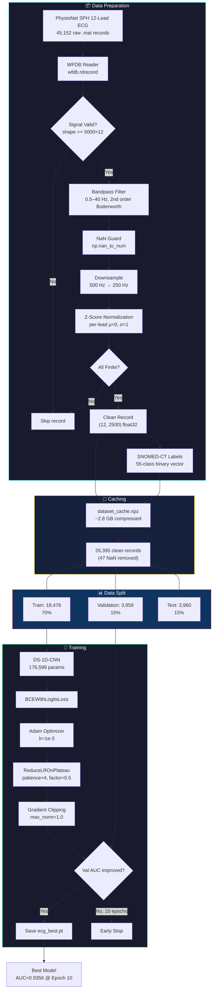
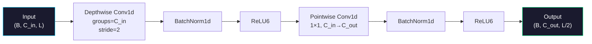
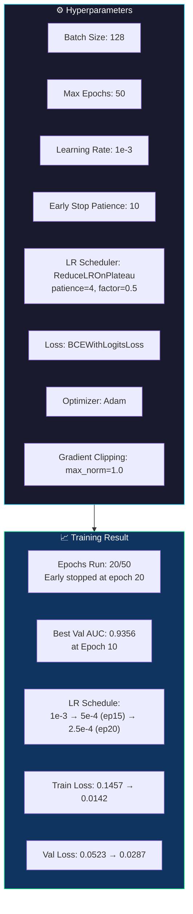
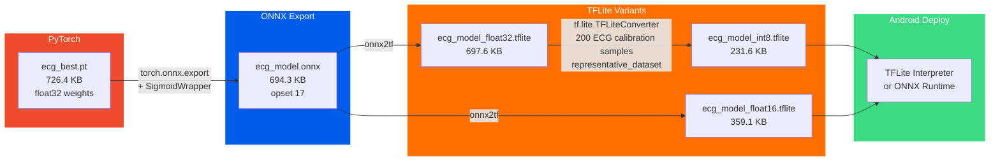
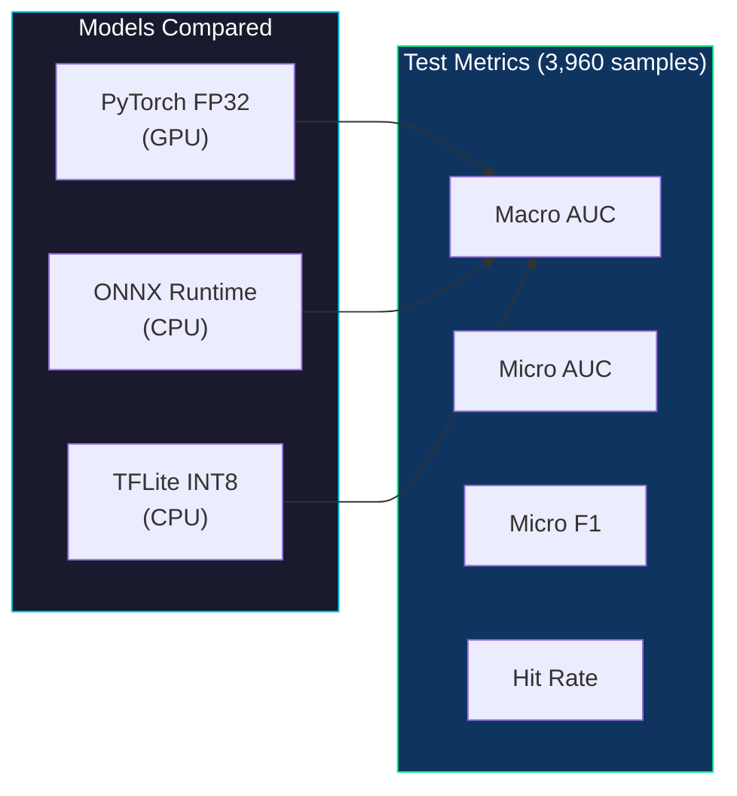
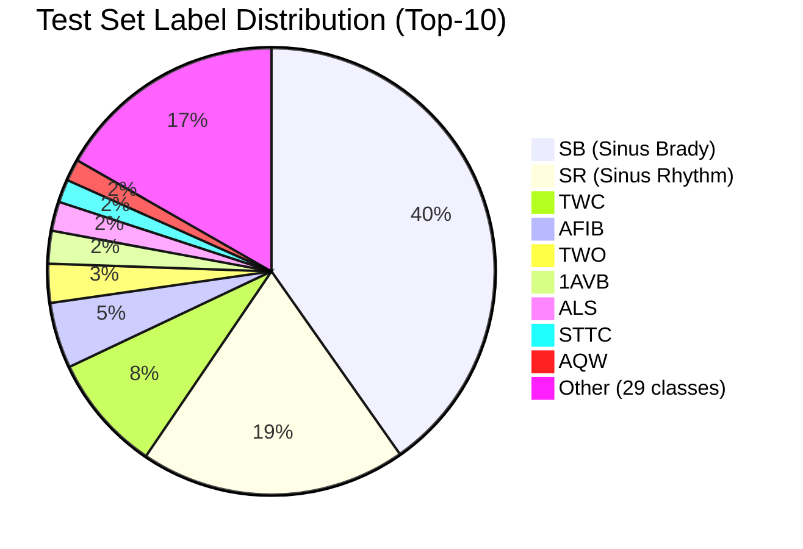
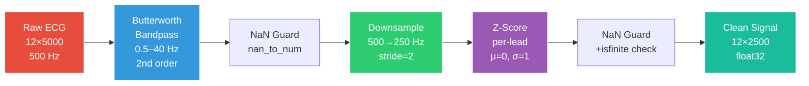

# DS-1D-CNN ECG Arrhythmia Classifier — Model Documentation

> **TÜBİTAK 2209-A — Hayatın Ritmi**
> Depthwise Separable 1D CNN for 12-Lead ECG Multi-Label Classification

---

## 1. Training Pipeline Overview



---

## 2. Model Architecture

```mermaid
flowchart LR
    subgraph INPUT["Input"]
        IN["(B, 12, 2500)<br/>12-lead ECG<br/>10s @ 250Hz"]
    end

    subgraph STEM["Stem"]
        S1["Conv1d(12→32, k=15, s=2)<br/>BatchNorm1d(32)<br/>ReLU6"]
    end

    subgraph BLOCKS["5× Depthwise Separable Blocks"]
        B1["DSConv(32→64, k=7, s=2)<br/>625 samples"]
        B2["DSConv(64→128, k=7, s=2)<br/>313 samples"]
        B3["DSConv(128→128, k=5, s=2)<br/>157 samples"]
        B4["DSConv(128→256, k=5, s=2)<br/>79 samples"]
        B5["DSConv(256→256, k=3, s=2)<br/>40 samples"]
    end

    subgraph HEAD["Classification Head"]
        H1["AdaptiveAvgPool1d(1)"]
        H2["Flatten → (B, 256)"]
        H3["Dropout(0.3)"]
        H4["Linear(256→128)<br/>BatchNorm1d + ReLU6"]
        H5["Linear(128→55)<br/>55-class logits"]
    end

    subgraph OUT["Output"]
        O1["Sigmoid<br/>(B, 55) probabilities"]
    end

    IN --> S1 --> B1 --> B2 --> B3 --> B4 --> B5 --> H1 --> H2 --> H3 --> H4 --> H5 --> O1

    style INPUT fill:#1a1a2e,stroke:#00d4ff,color:#fff
    style STEM fill:#16213e,stroke:#ffd700,color:#fff
    style BLOCKS fill:#0f3460,stroke:#e94560,color:#fff
    style HEAD fill:#1a1a2e,stroke:#00ff88,color:#fff
    style OUT fill:#16213e,stroke:#ff6b6b,color:#fff
```



### DSConv1d Block Detail



---

## 3. Layer-by-Layer Specification

| # | Layer | Type | Output Shape | Parameters | Neurons |
|---|---|---|---|---|---|
| 1 | stem.0 | Conv1d(12→32, k=15, s=2) | (B, 32, 1250) | 5,760 | 32 |
| 2 | stem.1 | BatchNorm1d(32) | (B, 32, 1250) | 64 | — |
| 3 | blocks.0.dw | Conv1d(32→32, k=7, s=2, groups=32) | (B, 32, 625) | 224 | — |
| 4 | blocks.0.bn1 | BatchNorm1d(32) | (B, 32, 625) | 64 | — |
| 5 | blocks.0.pw | Conv1d(32→64, k=1) | (B, 64, 625) | 2,048 | 64 |
| 6 | blocks.0.bn2 | BatchNorm1d(64) | (B, 64, 625) | 128 | — |
| 7 | blocks.1.dw | Conv1d(64→64, k=7, s=2, groups=64) | (B, 64, 313) | 448 | — |
| 8 | blocks.1.bn1 | BatchNorm1d(64) | (B, 64, 313) | 128 | — |
| 9 | blocks.1.pw | Conv1d(64→128, k=1) | (B, 128, 313) | 8,192 | 128 |
| 10 | blocks.1.bn2 | BatchNorm1d(128) | (B, 128, 313) | 256 | — |
| 11 | blocks.2.dw | Conv1d(128→128, k=5, s=2, groups=128) | (B, 128, 157) | 640 | — |
| 12 | blocks.2.bn1 | BatchNorm1d(128) | (B, 128, 157) | 256 | — |
| 13 | blocks.2.pw | Conv1d(128→128, k=1) | (B, 128, 157) | 16,384 | 128 |
| 14 | blocks.2.bn2 | BatchNorm1d(128) | (B, 128, 157) | 256 | — |
| 15 | blocks.3.dw | Conv1d(128→128, k=5, s=2, groups=128) | (B, 128, 79) | 640 | — |
| 16 | blocks.3.bn1 | BatchNorm1d(128) | (B, 128, 79) | 256 | — |
| 17 | blocks.3.pw | Conv1d(128→256, k=1) | (B, 256, 79) | 32,768 | 256 |
| 18 | blocks.3.bn2 | BatchNorm1d(256) | (B, 256, 79) | 512 | — |
| 19 | blocks.4.dw | Conv1d(256→256, k=3, s=2, groups=256) | (B, 256, 40) | 768 | — |
| 20 | blocks.4.bn1 | BatchNorm1d(256) | (B, 256, 40) | 512 | — |
| 21 | blocks.4.pw | Conv1d(256→256, k=1) | (B, 256, 40) | 65,536 | 256 |
| 22 | blocks.4.bn2 | BatchNorm1d(256) | (B, 256, 40) | 512 | — |
| 23 | head.0 | AdaptiveAvgPool1d(1) | (B, 256, 1) | — | — |
| 24 | head.1 | Flatten | (B, 256) | — | — |
| 25 | head.2 | Dropout(0.3) | (B, 256) | — | — |
| 26 | head.3 | Linear(256→128) | (B, 128) | 32,896 | 128 |
| 27 | head.4 | BatchNorm1d(128) | (B, 128) | 256 | — |
| 28 | head.6 | Linear(128→55) | (B, 55) | 7,095 | 55 |
| | **TOTAL** | | | **176,599** | **1,047** |

---

## 4. Training Methodology



### Training Curve (Epoch-by-Epoch)

| Epoch | Train Loss | Val Loss | Val AUC | LR |
|---|---|---|---|---|
| 1 | 0.1457 | 0.0523 | 0.7854 | 1e-3 |
| 2 | 0.0385 | 0.0369 | 0.8334 | 1e-3 |
| 3 | 0.0316 | 0.0314 | 0.8806 | 1e-3 |
| 5 | 0.0265 | 0.0285 | 0.8952 | 1e-3 |
| 7 | 0.0241 | 0.0269 | 0.9086 | 1e-3 |
| **10** | **0.0218** | **0.0258** | **0.9356** | **1e-3** |
| 15 | 0.0187 | 0.0268 | 0.9154 | 5e-4 |
| 20 | 0.0142 | 0.0287 | 0.9281 | 2.5e-4 |

---

## 5. Model Export Pipeline



### Export Details

| Format | File | Size | Input Shape | Input Dtype | Output Dtype |
|---|---|---|---|---|---|
| PyTorch | ecg_best.pt | 726.4 KB | (B, 12, 2500) | float32 | float32 logits |
| ONNX | ecg_model.onnx | 694.3 KB | (B, 12, 2500) | float32 | float32 probs |
| TFLite FP32 | ecg_model_float32.tflite | 697.6 KB | (1, 2500, 12) | float32 | float32 |
| TFLite FP16 | ecg_model_float16.tflite | 359.1 KB | (1, 2500, 12) | float32 | float32 |
| TFLite INT8 | ecg_model_int8.tflite | 231.6 KB | (1, 2500, 12) | int8 | float32 |

> **Note:** TFLite uses channels-last format (B, 2500, 12) vs PyTorch/ONNX channels-first (B, 12, 2500).
> INT8 quantization: scale=0.0909, zero_point=-9.

---

## 6. Test Set Evaluation



### Accuracy Comparison

| Metric | PyTorch FP32 | TFLite INT8 | Delta |
|---|---|---|---|
| **Macro AUC** | **0.9517** | **0.9334** | -0.018 |
| **Micro AUC** | **0.9924** | **0.9916** | -0.001 |
| Micro F1 | 0.8581 | 0.8592 | +0.001 |
| Weighted F1 | 0.8108 | 0.8125 | +0.002 |
| Sample Hit Rate | 0.9568 | 0.9773 | +0.021 |
| Active Classes | 38 / 55 | 38 / 55 | — |

### Speed Benchmark

| Backend | Avg Latency | Throughput | Size |
|---|---|---|---|
| GPU (RTX 4050) single | 1.94 ms | 516 ECG/s | 726 KB |
| GPU batch=32 | 0.95 ms | 33,810 ECG/s | — |
| CPU (PyTorch) | 11.34 ms | 88 ECG/s | — |
| ONNX Runtime CPU | 4.56 ms | 220 ECG/s | 694 KB |
| **TFLite INT8 CPU** | **0.84 ms** | **1,185 ECG/s** | **232 KB** |
| TFLite FP16 CPU | 1.14 ms | 878 ECG/s | 359 KB |
| TFLite FP32 CPU | 1.18 ms | 846 ECG/s | 698 KB |

---

## 7. Per-Class AUC (Top-15 & Bottom-5)

### Top-15 Classes (PyTorch)

| # | Condition | AUC | Test Support |
|---|---|---|---|
| 1 | SB (Sinus Bradycardia) | 0.9991 | 2,399 |
| 2 | SR (Sinus Rhythm) | 0.9990 | 1,147 |
| 3 | AFIB (Atrial Fibrillation) | 0.9986 | 284 |
| 4 | VEB (Ventricular Ectopic Beat) | 0.9979 | 4 |
| 5 | 3AVB (3rd Degree AV Block) | 0.9963 | 4 |
| 6 | RBBB (Right Bundle Branch Block) | 0.9944 | 64 |
| 7 | JEB (Junctional Ectopic Beat) | 0.9923 | 6 |
| 8 | CR (Cardiac Rhythm) | 0.9919 | 1 |
| 9 | MISW (Myocardial Ischemia ST/W) | 0.9914 | 10 |
| 10 | VFW (Ventricular Fibrillation/W) | 0.9901 | 5 |
| 11 | 1AVB (1st Degree AV Block) | 0.9893 | 141 |
| 12 | ALS (Anterolateral ST) | 0.9893 | 126 |
| 13 | LFBBB (Left Fascicular BBB) | 0.9864 | 18 |
| 14 | RVH (Right Ventricular Hypertrophy) | 0.9864 | 2 |
| 15 | RAH (Right Atrial Hypertrophy) | 0.9843 | 2 |

### Bottom-5 Classes

| # | Condition | AUC | Test Support | Note |
|---|---|---|---|---|
| 34 | APB (Atrial Premature Beat) | 0.8532 | 89 | Morphology overlap |
| 35 | CCR (Complete Cardiac Rhythm) | 0.8690 | 17 | Low support |
| 36 | PWC (P-Wave Change) | 0.8200 | 7 | Very low support |
| 37 | WPW (Wolff-Parkinson-White) | 0.6651 | 4 | Rare condition |
| 38 | JPT (Junctional Premature Tach.) | 0.4837 | 1 | Single sample |

---

## 8. Dataset Distribution



---

## 9. Preprocessing Pipeline Detail



---

## 10. Hardware & Environment

| Component | Specification |
|---|---|
| GPU | NVIDIA RTX 4050 Laptop, 6 GB VRAM |
| Driver | NVIDIA 560.94, CUDA 12.4 |
| Framework | PyTorch 2.6.0+cu124 |
| Python | 3.11 (conda: ecg_tf) |
| TensorFlow | 2.16.2 (CPU-only, for TFLite conversion) |
| Dataset | PhysioNet SPH 12-Lead ECG, 26,395 clean records |
| Training Time | ~20 epochs, early stopped |
| OS | Windows 11 |

---

## 11. File Inventory

```
dataset/
├── train_ecg_pytorch.py        # Main training script (PyTorch + CUDA)
├── evaluate_model.py           # PyTorch/ONNX evaluation + benchmark
├── evaluate_tflite.py          # TFLite INT8 evaluation + benchmark
├── export_tflite_int8.py       # INT8 quantization with calibration data
├── download_ecg.py             # PhysioNet dataset downloader
└── models/
    ├── ecg_best.pt             # PyTorch weights (726 KB)
    ├── ecg_model.onnx          # ONNX model (694 KB)
    ├── training_log.csv        # 20-epoch training log
    ├── evaluation_results.json # PyTorch test metrics
    ├── dataset_cache.npz       # Preprocessed dataset cache (~2.8 GB)
    ├── tflite_evaluation_results.json  # TFLite test metrics
    └── tflite/
        ├── ecg_model_float32.tflite    # 697.6 KB
        ├── ecg_model_float16.tflite    # 359.1 KB
        └── ecg_model_int8.tflite       # 231.6 KB (Android target)
```
