# DS-1D-CNN ECG Arrhythmia Classifier — Model Documentation

> **TÜBİTAK 2209-A — Hayatın Ritmi**
> Depthwise Separable 1D CNN for 12-Lead ECG Multi-Label Classification
> *Last updated: 2026-02-27 — Combined model v2 (6-dataset training)*

---

## Table of Contents

1. [Training Pipeline Overview](#1-training-pipeline-overview)
2. [Model Architecture](#2-model-architecture)
3. [Layer-by-Layer Specification](#3-layer-by-layer-specification)
4. [Dataset Details](#4-dataset-details)
5. [SNOMED-CT Label Taxonomy](#5-snomed-ct-label-taxonomy)
6. [Training Methodology — Phase 1 (SPH Only)](#6-training-methodology--phase-1-sph-only)
7. [Cross-Dataset Evaluation](#7-cross-dataset-evaluation)
8. [Combined Retraining — Phase 2 (6 Datasets)](#8-combined-retraining--phase-2-6-datasets)
9. [Per-Class AUC Analysis](#9-per-class-auc-analysis)
10. [Model Export Pipeline](#10-model-export-pipeline)
11. [Speed Benchmarks](#11-speed-benchmarks)
12. [Preprocessing Pipeline Detail](#12-preprocessing-pipeline-detail)
13. [Hardware & Environment](#13-hardware--environment)
14. [File Inventory](#14-file-inventory)

---

## 1. Training Pipeline Overview

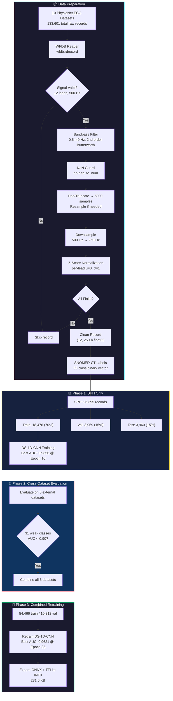

---

## 2. Model Architecture

```mermaid
flowchart LR
    subgraph INPUT["Input"]
        IN["(B, 12, 2500)<br/>12-lead ECG<br/>10s @ 250Hz"]
    end

    subgraph STEM["Stem"]
        S1["Conv1d(12→32, k=15, s=2)<br/>BatchNorm1d(32)<br/>ReLU6"]
    end

    subgraph BLOCKS["5× Depthwise Separable Blocks"]
        B1["DSConv(32→64, k=7, s=2)<br/>625 samples"]
        B2["DSConv(64→128, k=7, s=2)<br/>313 samples"]
        B3["DSConv(128→128, k=5, s=2)<br/>157 samples"]
        B4["DSConv(128→256, k=5, s=2)<br/>79 samples"]
        B5["DSConv(256→256, k=3, s=2)<br/>40 samples"]
    end

    subgraph HEAD["Classification Head"]
        H1["AdaptiveAvgPool1d(1)"]
        H2["Flatten → (B, 256)"]
        H3["Dropout(0.3)"]
        H4["Linear(256→128)<br/>BatchNorm1d + ReLU6"]
        H5["Linear(128→55)<br/>55-class logits"]
    end

    subgraph OUT["Output"]
        O1["Sigmoid<br/>(B, 55) probabilities"]
    end

    IN --> S1 --> B1 --> B2 --> B3 --> B4 --> B5 --> H1 --> H2 --> H3 --> H4 --> H5 --> O1

    style INPUT fill:#1a1a2e,stroke:#00d4ff,color:#fff
    style STEM fill:#16213e,stroke:#ffd700,color:#fff
    style BLOCKS fill:#0f3460,stroke:#e94560,color:#fff
    style HEAD fill:#1a1a2e,stroke:#00ff88,color:#fff
    style OUT fill:#16213e,stroke:#ff6b6b,color:#fff
```

### Mathematical Formulation

**Conv1d output length** — for input length $L_{\text{in}}$, kernel size $k$, stride $s$, and padding $p$:

$$L_{\text{out}} = \left\lfloor \frac{L_{\text{in}} + 2p - k}{s} \right\rfloor + 1$$

**Stem layer verification:** $L_{\text{out}} = \left\lfloor \frac{2500 + 2(7) - 15}{2} \right\rfloor + 1 = \left\lfloor \frac{2499}{2} \right\rfloor + 1 = 1250$

**Standard Conv1d** parameter count:

$$\Theta_{\text{std}} = C_{\text{out}} \cdot C_{\text{in}} \cdot k$$

**Depthwise Separable Conv1d** factorizes this into two operations:

$$\Theta_{\text{DS}} = \underbrace{C_{\text{in}} \cdot k}_{\text{depthwise}} + \underbrace{C_{\text{in}} \cdot C_{\text{out}}}_{\text{pointwise}}$$

**Computational cost ratio** — the DSConv reduction factor $\rho$:

$$\rho = \frac{\Theta_{\text{DS}}}{\Theta_{\text{std}}} = \frac{C_{\text{in}} \cdot k + C_{\text{in}} \cdot C_{\text{out}}}{C_{\text{out}} \cdot C_{\text{in}} \cdot k} = \frac{1}{C_{\text{out}}} + \frac{1}{k}$$

For `blocks.3` ($C_{\text{in}}=128$, $C_{\text{out}}=256$, $k=5$): $\rho = \frac{1}{256} + \frac{1}{5} \approx 0.204$ — an **~80% reduction** in parameters.

**Total model parameters:**

$$\Theta_{\text{total}} = \underbrace{\Theta_{\text{stem}}}_{5{,}824} + \sum_{i=0}^{4} \underbrace{\Theta_{\text{DS}}^{(i)} + \Theta_{\text{BN}}^{(i)}}_{\text{DSConv blocks}} + \underbrace{\Theta_{\text{head}}}_{40{,}247} = 176{,}599$$

### DSConv1d Block Detail

The DSConv1d block implements the depthwise separable factorization:

$$\mathbf{y} = \text{ReLU6}\!\Big(\text{BN}\!\big(\mathbf{W}_{\text{pw}} * \text{ReLU6}(\text{BN}(\mathbf{W}_{\text{dw}} *_{\text{dw}} \mathbf{x}))\big)\Big)$$

where $*_{\text{dw}}$ denotes depthwise (channel-wise) convolution with $\text{groups} = C_{\text{in}}$.

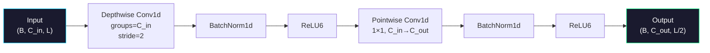

**ReLU6 activation function:**

$$\text{ReLU6}(x) = \min(\max(0, x), 6)$$

Chosen for quantization-friendly bounded output range $[0, 6]$, which improves INT8 precision.

---

## 3. Layer-by-Layer Specification

| $\ell$ | Layer Name | Type | Output Shape | $\Theta_\ell$ | Formula |
|:---:|---|---|---|---:|---|
| 1 | `stem.0` | Conv1d($12 \to 32$, $k{=}15$, $s{=}2$, $p{=}7$) | $(B, 32, 1250)$ | $5{,}760$ | $C_{\text{in}} \cdot C_{\text{out}} \cdot k = 12 \cdot 32 \cdot 15$ |
| 2 | `stem.1` | BatchNorm1d($32$) | $(B, 32, 1250)$ | $64$ | $2C = 2 \cdot 32$ |
| 3 | `blocks.0.dw` | DepthwiseConv1d($32$, $k{=}7$, $s{=}2$) | $(B, 32, 625)$ | $224$ | $C_{\text{in}} \cdot k = 32 \cdot 7$ |
| 4 | `blocks.0.bn1` | BatchNorm1d($32$) | $(B, 32, 625)$ | $64$ | $2C$ |
| 5 | `blocks.0.pw` | PointwiseConv1d($32 \to 64$) | $(B, 64, 625)$ | $2{,}048$ | $C_{\text{in}} \cdot C_{\text{out}} = 32 \cdot 64$ |
| 6 | `blocks.0.bn2` | BatchNorm1d($64$) | $(B, 64, 625)$ | $128$ | $2C$ |
| 7 | `blocks.1.dw` | DepthwiseConv1d($64$, $k{=}7$, $s{=}2$) | $(B, 64, 313)$ | $448$ | $C_{\text{in}} \cdot k = 64 \cdot 7$ |
| 8 | `blocks.1.bn1` | BatchNorm1d($64$) | $(B, 64, 313)$ | $128$ | $2C$ |
| 9 | `blocks.1.pw` | PointwiseConv1d($64 \to 128$) | $(B, 128, 313)$ | $8{,}192$ | $C_{\text{in}} \cdot C_{\text{out}} = 64 \cdot 128$ |
| 10 | `blocks.1.bn2` | BatchNorm1d($128$) | $(B, 128, 313)$ | $256$ | $2C$ |
| 11 | `blocks.2.dw` | DepthwiseConv1d($128$, $k{=}5$, $s{=}2$) | $(B, 128, 157)$ | $640$ | $C_{\text{in}} \cdot k = 128 \cdot 5$ |
| 12 | `blocks.2.bn1` | BatchNorm1d($128$) | $(B, 128, 157)$ | $256$ | $2C$ |
| 13 | `blocks.2.pw` | PointwiseConv1d($128 \to 128$) | $(B, 128, 157)$ | $16{,}384$ | $C_{\text{in}} \cdot C_{\text{out}} = 128 \cdot 128$ |
| 14 | `blocks.2.bn2` | BatchNorm1d($128$) | $(B, 128, 157)$ | $256$ | $2C$ |
| 15 | `blocks.3.dw` | DepthwiseConv1d($128$, $k{=}5$, $s{=}2$) | $(B, 128, 79)$ | $640$ | $C_{\text{in}} \cdot k = 128 \cdot 5$ |
| 16 | `blocks.3.bn1` | BatchNorm1d($128$) | $(B, 128, 79)$ | $256$ | $2C$ |
| 17 | `blocks.3.pw` | PointwiseConv1d($128 \to 256$) | $(B, 256, 79)$ | $32{,}768$ | $C_{\text{in}} \cdot C_{\text{out}} = 128 \cdot 256$ |
| 18 | `blocks.3.bn2` | BatchNorm1d($256$) | $(B, 256, 79)$ | $512$ | $2C$ |
| 19 | `blocks.4.dw` | DepthwiseConv1d($256$, $k{=}3$, $s{=}2$) | $(B, 256, 40)$ | $768$ | $C_{\text{in}} \cdot k = 256 \cdot 3$ |
| 20 | `blocks.4.bn1` | BatchNorm1d($256$) | $(B, 256, 40)$ | $512$ | $2C$ |
| 21 | `blocks.4.pw` | PointwiseConv1d($256 \to 256$) | $(B, 256, 40)$ | $65{,}536$ | $C_{\text{in}} \cdot C_{\text{out}} = 256 \cdot 256$ |
| 22 | `blocks.4.bn2` | BatchNorm1d($256$) | $(B, 256, 40)$ | $512$ | $2C$ |
| 23 | `head.0` | AdaptiveAvgPool1d($1$) | $(B, 256, 1)$ | $0$ | — |
| 24 | `head.1` | Flatten | $(B, 256)$ | $0$ | — |
| 25 | `head.2` | Dropout($p{=}0.3$) | $(B, 256)$ | $0$ | — |
| 26 | `head.3` | Linear($256 \to 128$) | $(B, 128)$ | $32{,}896$ | $C_{\text{in}} \cdot C_{\text{out}} + C_{\text{out}} = 256 \cdot 128 + 128$ |
| 27 | `head.4` | BatchNorm1d($128$) | $(B, 128)$ | $256$ | $2C$ |
| 28 | `head.6` | Linear($128 \to 55$) | $(B, 55)$ | $7{,}095$ | $C_{\text{in}} \cdot C_{\text{out}} + C_{\text{out}} = 128 \cdot 55 + 55$ |
| | **Total** | $\sum_{\ell} \Theta_\ell$ | | $\mathbf{176{,}599}$ | $\approx 0.17\text{M}$ |

**Parameter density** — parameters per output class:

$$\bar{\Theta} = \frac{\Theta_{\text{total}}}{C} = \frac{176{,}599}{55} \approx 3{,}211 \text{ params/class}$$

**Receptive field** of the full network — the stem + 5 strided blocks progressively downsample $2500 \to 1250 \to 625 \to 313 \to 157 \to 79 \to 40$, yielding an overall temporal reduction ratio:

$$R = \prod_{i=0}^{5} s_i = 2^6 = 64 \implies \text{each output cell sees } \sim\!\frac{2500}{40} = 62.5 \text{ input samples}$$

---

## 4. Dataset Details

### 4.1 Available Datasets (10 Total — 133,601 Records)

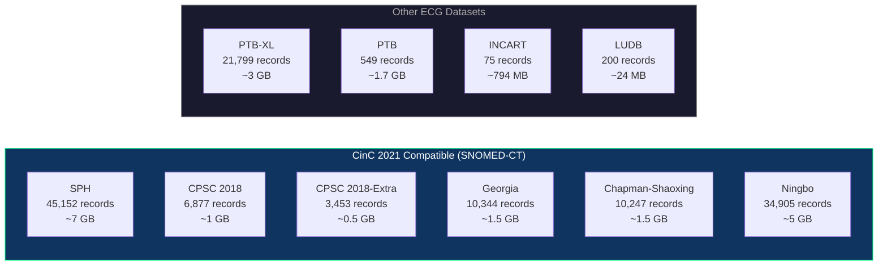

| $i$ | Dataset | Source | $N_{\text{raw}}$ | Leads | $f_s$ (Hz) | Size | Label System | Training |
|:---:|---------|--------|---:|:---:|---:|---:|--------|:---:|
| 1 | **SPH** | PhysioNet Chapman-Shaoxing/SPH | $45{,}152$ | $12$ | $500$ | $\sim\!7$ GB | SNOMED-CT | ✅ |
| 2 | **CPSC 2018** | China Physiological Signal Challenge | $6{,}877$ | $12$ | $500$ | $\sim\!1$ GB | SNOMED-CT | ✅ |
| 3 | **CPSC 2018-Extra** | Unused CPSC 2018 data | $3{,}453$ | $12$ | $500$ | $\sim\!0.5$ GB | SNOMED-CT | ✅ |
| 4 | **Georgia** | Georgia 12-Lead ECG Challenge | $10{,}344$ | $12$ | $500$ | $\sim\!1.5$ GB | SNOMED-CT | ✅ |
| 5 | **Chapman-Shaoxing** | Chapman-Shaoxing (CinC 2021) | $10{,}247$ | $12$ | $500$ | $\sim\!1.5$ GB | SNOMED-CT | ✅ |
| 6 | **Ningbo** | Ningbo First Hospital (CinC 2021) | $34{,}905$ | $12$ | $500$ | $\sim\!5$ GB | SNOMED-CT | ✅ |
| 7 | PTB-XL | Large ECG Dataset | $21{,}799$ | $12$ | $500$ | $\sim\!3$ GB | SCP-ECG | — |
| 8 | PTB | Diagnostic ECG Database | $549$ | $15$ | $1000$ | $\sim\!1.7$ GB | Diagnostic | — |
| 9 | INCART | St Petersburg Arrhythmia | $75$ | $12$ | $257$ | $\sim\!794$ MB | Beat annot. | — |
| 10 | LUDB | Lobachevsky University | $200$ | $12$ | $500$ | $\sim\!24$ MB | Wave delin. | — |

**Aggregate statistics:**

$$N_{\text{total}} = \sum_{i=1}^{10} N_i = 133{,}601 \quad\text{records across all datasets}$$

$$N_{\text{CinC}} = \sum_{i=1}^{6} N_i = 110{,}978 \quad\text{SNOMED-CT compatible records}$$

### 4.2 Data Filtering & Usable Records

Records are filtered during loading. A record $\mathbf{x}_i$ is accepted iff:

$$\mathbf{x}_i \in \mathcal{D}_{\text{valid}} \iff \begin{cases} n_{\text{leads}}(\mathbf{x}_i) = 12 \\ \exists\, j : y_{ij} \in \mathcal{S}_{55} \\ \lVert \mathbf{x}_i \rVert < \infty \end{cases}$$

where $\mathcal{S}_{55}$ is the set of 55 recognized SNOMED-CT codes.

Signals are padded or truncated to $T_0 = 5000$ samples at $f_s = 500\text{ Hz}$, then NaN/infinite values cause rejection.

| Dataset | $N_{\text{raw}}$ | $N_{\text{valid}}$ | $N_{\text{skip}}$ | $\eta = \frac{N_{\text{valid}}}{N_{\text{raw}}}$ |
|---------|---:|---:|---:|:---:|
| SPH | $45{,}152$ | $26{,}395$ | $18{,}757$ | $58.5\%$ |
| CPSC 2018 | $6{,}874$ | $6{,}265$ | $609$ | $91.1\%$ |
| CPSC 2018-Extra | $3{,}453$ | $2{,}192$ | $1{,}261$ | $63.5\%$ |
| Georgia | $10{,}342$ | $8{,}118$ | $2{,}224$ | $78.5\%$ |
| Chapman-Shaoxing | $10{,}247$ | $7{,}505$ | $2{,}742$ | $73.2\%$ |
| Ningbo | $34{,}905$ | $18{,}263$ | $16{,}642$ | $52.3\%$ |
| **Total** | $110{,}973$ | $68{,}738$ | $42{,}235$ | $\bar{\eta} = 62.0\%$ |

### 4.3 Combined Training Data Split

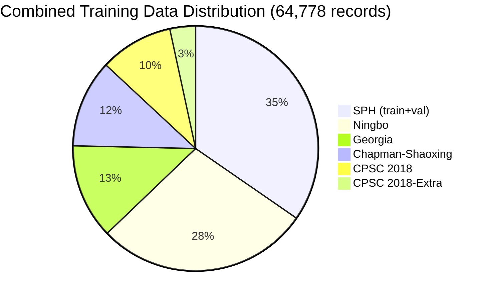

| Dataset | $N_{\text{train}}$ ($85\%$) | $N_{\text{val}}$ ($15\%$) | $N_{\text{total}}$ |
|---------|---:|---:|---:|
| SPH | $18{,}476$ | $3{,}959$ | $22{,}435$ |
| CPSC 2018 | $5{,}325$ | $940$ | $6{,}265$ |
| CPSC 2018-Extra | $1{,}863$ | $329$ | $2{,}192$ |
| Georgia | $6{,}900$ | $1{,}218$ | $8{,}118$ |
| Chapman-Shaoxing | $6{,}379$ | $1{,}126$ | $7{,}505$ |
| Ningbo | $15{,}523$ | $2{,}740$ | $18{,}263$ |
| **Total** | $\mathbf{54{,}466}$ | $\mathbf{10{,}312}$ | $\mathbf{64{,}778}$ |

$$\text{Split ratio:} \quad \frac{N_{\text{train}}}{N_{\text{total}}} = \frac{54{,}466}{64{,}778} \approx 0.8408 \quad , \quad \frac{N_{\text{val}}}{N_{\text{total}}} = \frac{10{,}312}{64{,}778} \approx 0.1592$$

> **SPH test set** ($N_{\text{test}} = 3{,}960$ records) is held out from all training — used only for evaluation.

---

## 5. SNOMED-CT Label Taxonomy

The model classifies **55 unique SNOMED-CT codes** mapped from 63 condition acronyms (some codes are shared across conditions).

### 5.1 Full Condition List

| # | Acronym | Full Name | SNOMED-CT Code |
|---|---------|-----------|----------------|
| 1 | 1AVB | 1st degree atrioventricular block | 270492004 |
| 2 | 2AVB | 2nd degree atrioventricular block | 195042002 |
| 3 | 2AVB1 | 2nd degree AV block (Type I — Wenckebach) | 54016002 |
| 4 | 2AVB2 | 2nd degree AV block (Type II) | 28189009 |
| 5 | 3AVB | 3rd degree (complete) AV block | 27885002 |
| 6 | ABI | Atrial bigeminy | 251173003 |
| 7 | ALS | Axis left shift | 39732003 |
| 8 | APB | Atrial premature beats | 284470004 |
| 9 | AQW | Abnormal Q wave | 164917005 |
| 10 | ARS | Axis right shift | 47665007 |
| 11 | AVB | Atrioventricular block (generic) | 233917008 |
| 12 | CCR | Counterclockwise rotation | 251199005 |
| 13 | CR | Clockwise rotation | 251198002 |
| 14 | ERV | Early repolarization of the ventricles | 428417006 |
| 15 | FQRS | Fragmented QRS wave | 164942001 |
| 16 | IDC / IVB | Interior differences conduction / Intraventricular block | 698252002 |
| 17 | JEB | Junctional escape beat | 426995002 |
| 18 | JPT | Junctional premature beat | 251164006 |
| 19 | LBBB / LBBBB / LFBBB | Left bundle branch block variants | 164909002 |
| 20 | LVH | Left ventricle hypertrophy | 164873001 |
| 21 | LVQRSAL | Lower voltage QRS in all leads | 251146004 |
| 22 | LVQRSCL | Lower voltage QRS in chest leads | 251148003 |
| 23 | LVQRSLL | Lower voltage QRS in limb leads | 251147008 |
| 24 | MI / MIBW / MIFW / MILW / MISW | Myocardial infarction (all walls) | 164865005 |
| 25 | PRIE | PR interval extension | 164947007 |
| 26 | PWC | P wave change | 164912004 |
| 27 | QTIE | QT interval extension | 111975006 |
| 28 | RAH | Right atrial hypertrophy | 446358003 |
| 29 | RBBB | Right bundle branch block | 59118001 |
| 30 | RVH | Right ventricle hypertrophy | 89792004 |
| 31 | STDD | ST segment depression | 429622005 |
| 32 | STE | ST segment elevation | 164930006 |
| 33 | STTC | ST-T wave change | 428750005 |
| 34 | STTU | ST segment tilt up | 164931005 |
| 35 | TWC | T wave change | 164934002 |
| 36 | TWO | T wave inversion | 59931005 |
| 37 | UW | U wave | 164937009 |
| 38 | VB | Ventricular bigeminy | 11157007 |
| 39 | VEB | Ventricular escape beat | 75532003 |
| 40 | VFW | Ventricular fusion wave | 13640000 |
| 41 | VPB | Ventricular premature beat | 17338001 |
| 42 | VPE | Ventricular preexcitation | 195060002 |
| 43 | VET | Ventricular escape trigeminy | 251180001 |
| 44 | WAVN / SAAWR | Wandering atrial pacemaker | 195101003 |
| 45 | WPW | Wolff-Parkinson-White syndrome | 74390002 |
| 46 | SB | Sinus bradycardia | 426177001 |
| 47 | SR | Sinus rhythm (normal) | 426783006 |
| 48 | AFIB | Atrial fibrillation | 164889003 |
| 49 | ST | Sinus tachycardia | 427084000 |
| 50 | AF | Atrial flutter | 164890007 |
| 51 | SA | Sinus irregularity | 427393009 |
| 52 | SVT | Supraventricular tachycardia | 426761007 |
| 53 | AT | Atrial tachycardia | 713422000 |
| 54 | AVNRT | AV node reentrant tachycardia | 233896004 |
| 55 | AVRT | AV reentrant tachycardia | 233897008 |

### 5.2 Shared SNOMED-CT Codes (Duplicates in CSV)

| Shared Code | Conditions Mapped | Model Output |
|---|---|---|
| 698252002 | IDC, IVB | Single class |
| 164909002 | LBBB, LBBBB, LFBBB | Single class |
| 164865005 | MI, MIBW, MIFW, MILW, MISW | Single class |
| 195101003 | WAVN, SAAWR | Single class |

> 63 rows in CSV → 55 unique SNOMED codes → **55 output classes** (`NUM_CLASSES = 55`)

---

## 6. Training Methodology — Phase 1 (SPH Only)

### Loss Function — Binary Cross-Entropy with Logits

For multi-label classification with $C = 55$ classes, the model outputs raw logits $z_{j} \in \mathbb{R}$. The loss applies the sigmoid function $\sigma$ internally for numerical stability:

$$\mathcal{L}_{\text{BCE}} = -\frac{1}{N}\sum_{i=1}^{N}\sum_{j=1}^{C}\Big[y_{ij}\cdot\log\!\big(\sigma(z_{ij})\big) + (1 - y_{ij})\cdot\log\!\big(1 - \sigma(z_{ij})\big)\Big]$$

where $\sigma(z) = \frac{1}{1 + e^{-z}}$ is the sigmoid function and $y_{ij} \in \{0, 1\}$ are the multi-hot ground truth labels.

### Optimizer — Adam

The Adam optimizer maintains running estimates of the first moment $m_t$ and second moment $v_t$:

$$m_t = \beta_1 \cdot m_{t-1} + (1 - \beta_1) \cdot g_t \qquad v_t = \beta_2 \cdot v_{t-1} + (1 - \beta_2) \cdot g_t^2$$

$$\hat{m}_t = \frac{m_t}{1 - \beta_1^t} \qquad \hat{v}_t = \frac{v_t}{1 - \beta_2^t} \qquad \theta_{t+1} = \theta_t - \alpha \cdot \frac{\hat{m}_t}{\sqrt{\hat{v}_t} + \epsilon}$$

with $\alpha = 10^{-3}$, $\beta_1 = 0.9$, $\beta_2 = 0.999$, $\epsilon = 10^{-8}$.

### Learning Rate Scheduler — ReduceLROnPlateau

$$\alpha_{t+1} = \begin{cases} \gamma \cdot \alpha_t & \text{if } \text{AUC}_{\text{val}} \text{ has not improved for } P \text{ epochs} \\ \alpha_t & \text{otherwise} \end{cases}$$

with decay factor $\gamma = 0.5$ and patience $P = 5$ (Phase 1) or $P = 4$ (Phase 2).

### Gradient Clipping

$$\tilde{g} = \begin{cases} g & \text{if } \lVert g \rVert_2 \leq \tau \\ \tau \cdot \frac{g}{\lVert g \rVert_2} & \text{otherwise} \end{cases} \qquad \tau = 1.0$$

### Evaluation Metric — AUC-ROC

The **macro-averaged AUC** is computed per-class and averaged:

$$\text{AUC}_{\text{macro}} = \frac{1}{|\mathcal{C}_{\text{active}}|} \sum_{j \in \mathcal{C}_{\text{active}}} \text{AUC}_j$$

where $\mathcal{C}_{\text{active}} \subseteq \{1, \ldots, 55\}$ is the set of classes with $\geq 1$ positive and $\geq 1$ negative sample. For a single class:

$$\text{AUC}_j = \frac{1}{|\mathcal{P}_j| \cdot |\mathcal{N}_j|} \sum_{p \in \mathcal{P}_j} \sum_{n \in \mathcal{N}_j} \mathbb{1}[\hat{y}_p > \hat{y}_n]$$

where $\mathcal{P}_j$ and $\mathcal{N}_j$ are the sets of positive and negative samples for class $j$.

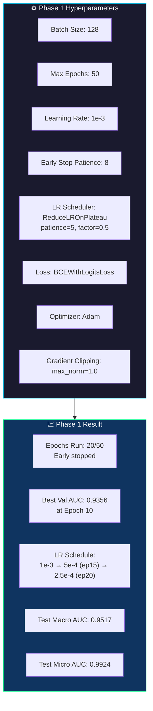

### Phase 1 Training Curve

| Epoch | $\mathcal{L}_{\text{train}}$ | $\mathcal{L}_{\text{val}}$ | $\text{AUC}_{\text{val}}$ | $\alpha$ |
|:---:|---:|---:|---:|---:|
| $1$ | $0.1457$ | $0.0523$ | $0.7854$ | $10^{-3}$ |
| $2$ | $0.0385$ | $0.0369$ | $0.8334$ | $10^{-3}$ |
| $3$ | $0.0316$ | $0.0314$ | $0.8806$ | $10^{-3}$ |
| $5$ | $0.0265$ | $0.0285$ | $0.8952$ | $10^{-3}$ |
| $7$ | $0.0241$ | $0.0269$ | $0.9086$ | $10^{-3}$ |
| $\mathbf{10}$ | $\mathbf{0.0218}$ | $\mathbf{0.0258}$ | $\mathbf{0.9356}$ | $10^{-3}$ |
| $15$ | $0.0187$ | $0.0268$ | $0.9154$ | $5 \times 10^{-4}$ |
| $20$ | $0.0142$ | $0.0287$ | $0.9281$ | $2.5 \times 10^{-4}$ |

### Phase 1 Test Results (SPH Test Set — $N_{\text{test}} = 3{,}960$)

| Metric | Value |
|---|---:|
| $\text{AUC}_{\text{macro}}$ | $\mathbf{0.9517}$ |
| $\text{AUC}_{\text{micro}}$ | $\mathbf{0.9924}$ |
| $F_{1,\text{micro}}$ | $0.8581$ |
| $F_{1,\text{weighted}}$ | $0.8108$ |
| $|\mathcal{C}_{\text{active}}|$ | $38 / 55$ |

---

## 7. Cross-Dataset Evaluation

The Phase 1 model (trained on SPH only) was evaluated on 5 external CinC 2021 datasets to test generalization.

### 7.1 Cross-Dataset Evaluation Pipeline

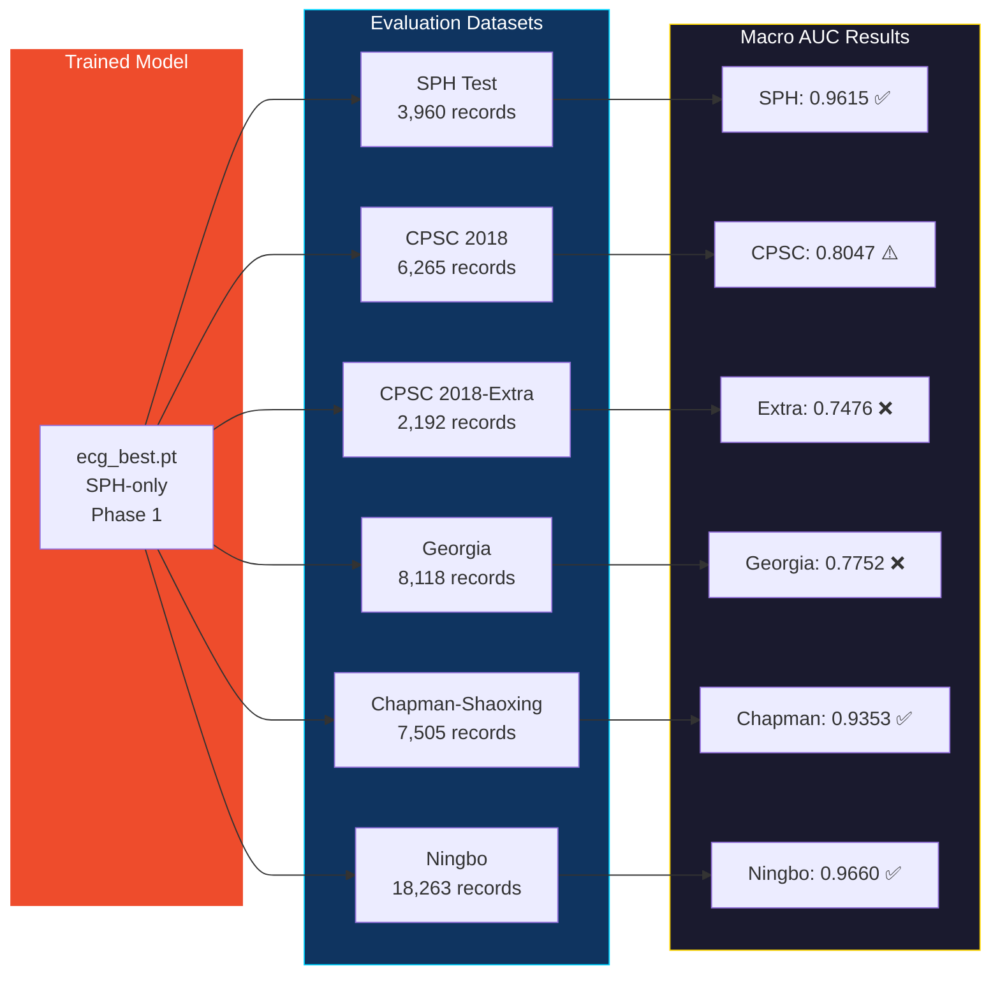

### 7.2 Original Model Performance (Before Retraining)

| Dataset | $N$ | $|\mathcal{C}|$ | $\text{AUC}_{\text{macro}}$ | $\text{AUC}_{\text{micro}}$ | Weak ($\text{AUC}_j < 0.9$) |
|---------|---:|:---:|:---:|:---:|:---:|
| **SPH** (baseline) | $3{,}960$ | $37$ | $0.9615$ | $0.9928$ | $4$ |
| **CPSC 2018** | $6{,}265$ | $8$ | $0.8047$ | $0.8113$ | $5$ |
| **CPSC 2018-Extra** | $2{,}192$ | $32$ | $0.7476$ | $0.7388$ | $23$ |
| **Georgia** | $8{,}118$ | $32$ | $0.7752$ | $0.8494$ | $22$ |
| **Chapman-Shaoxing** | $7{,}505$ | $40$ | $0.9353$ | $0.9888$ | $11$ |
| **Ningbo** | $18{,}263$ | $32$ | $0.9660$ | $0.9945$ | $2$ |

### 7.3 Weak Class Analysis (31 Classes with AUC < 0.90)

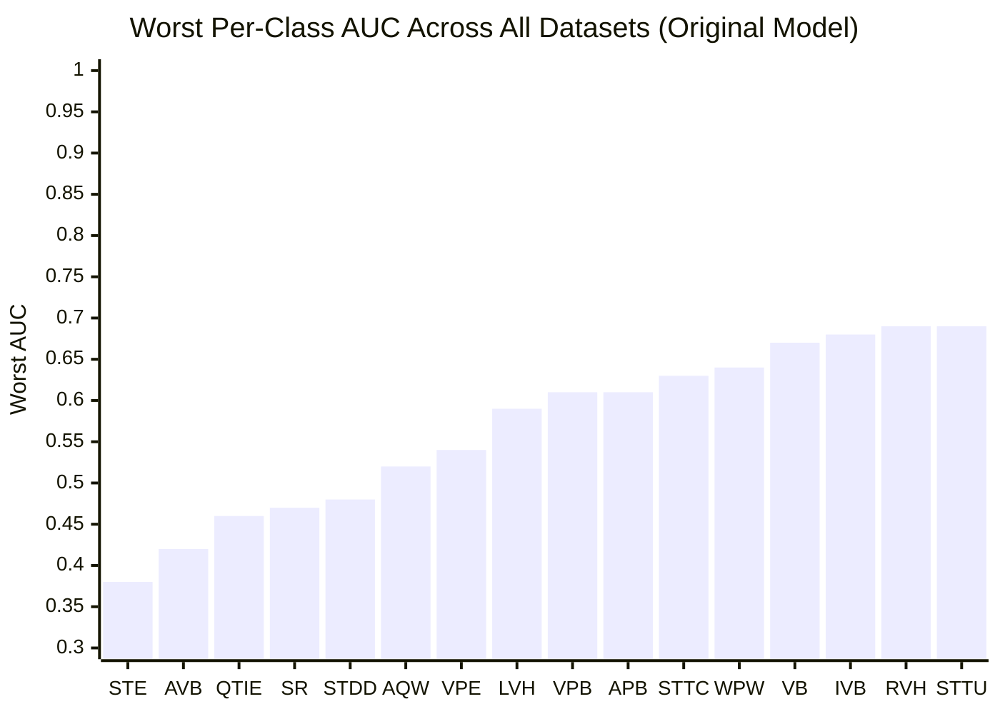

**Top 10 Most Problematic Classes** (sorted by $\min_d \text{AUC}_{j,d}$):

| Class | $\min_d \text{AUC}_j$ | $\bar{\text{AUC}}_j$ | $|\text{support}|$ | Worst Dataset |
|---|:---:|:---:|---:|---|
| STE (ST elevation) | $0.3766$ | $0.7094$ | $1{,}894$ | CPSC2018-Extra |
| AVB (AV block) | $0.4166$ | $0.6725$ | $14$ | CPSC2018-Extra |
| QTIE (QT prolongation) | $0.4591$ | $0.7864$ | $1{,}470$ | CPSC2018-Extra |
| SR (Sinus rhythm) | $0.4657$ | $0.8512$ | $11{,}794$ | CPSC2018-Extra |
| STDD (ST depression) | $0.4802$ | $0.7547$ | $1{,}587$ | CPSC2018-Extra |
| AQW (Abnormal Q wave) | $0.5244$ | $0.7983$ | $974$ | CPSC2018-Extra |
| VPE (Ventricular preexcitation) | $0.5395$ | $0.7353$ | $13$ | Georgia |
| LVH (LV hypertrophy) | $0.5916$ | $0.8187$ | $1{,}364$ | Georgia |
| VPB (Ventricular PB) | $0.6098$ | $0.7975$ | $517$ | CPSC2018-Extra |
| APB (Atrial PB) | $0.6132$ | $0.7568$ | $1{,}902$ | CPSC2018 |

**Weak class threshold criterion:**

$$\mathcal{W} = \{j \in \mathcal{C} \mid \exists\, d : \text{AUC}_{j,d} < 0.90\} \qquad |\mathcal{W}| = 31$$

---

## 8. Combined Retraining — Phase 2 (6 Datasets)

### 8.1 Combined Training Configuration

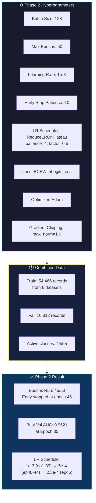

### 8.2 Phase 2 Training Curve (Key Epochs)

| Epoch | $\mathcal{L}_{\text{train}}$ | $\mathcal{L}_{\text{val}}$ | $\text{AUC}_{\text{val}}$ | $\alpha$ | |
|:---:|---:|---:|---:|---:|:---:|
| $1$ | $0.0931$ | $0.0451$ | $0.8336$ | $10^{-3}$ | ★ |
| $3$ | $0.0391$ | $0.0374$ | $0.9039$ | $10^{-3}$ | ★ |
| $6$ | $0.0347$ | $0.0339$ | $0.9320$ | $10^{-3}$ | ★ |
| $9$ | $0.0317$ | $0.0326$ | $0.9403$ | $10^{-3}$ | ★ |
| $14$ | $0.0274$ | $0.0314$ | $0.9512$ | $10^{-3}$ | ★ |
| $21$ | $0.0228$ | $0.0311$ | $0.9549$ | $10^{-3}$ | ★ |
| $28$ | $0.0193$ | $0.0317$ | $0.9588$ | $10^{-3}$ | ★ |
| $\mathbf{35}$ | $\mathbf{0.0169}$ | $\mathbf{0.0316}$ | $\mathbf{0.9621}$ | $10^{-3}$ | **★ Best** |
| $40$ | $0.0158$ | $0.0322$ | $0.9603$ | $5 \times 10^{-4}$ | — |
| $45$ | $0.0110$ | $0.0330$ | $0.9589$ | $2.5 \times 10^{-4}$ | Early stop |

**Overfitting gap at best epoch:**

$$\Delta\mathcal{L} = \mathcal{L}_{\text{val}} - \mathcal{L}_{\text{train}} = 0.0316 - 0.0169 = 0.0147$$

### 8.3 Comparison: Original vs Combined Retrained

```mermaid
xychart-beta
    title "Macro AUC: Original vs Retrained Model"
    x-axis ["SPH", "CPSC2018", "CPSC-Extra", "Georgia", "Chapman", "Ningbo"]
    y-axis "Macro AUC" 0.7 --> 1.0
    bar "Original" [0.9615, 0.8047, 0.7476, 0.7752, 0.9353, 0.9660]
    bar "Retrained" [0.9852, 0.9860, 0.9228, 0.9503, 0.9944, 0.9969]
```

| Dataset | $\text{AUC}^{(1)}_{\text{macro}}$ | $\text{AUC}^{(2)}_{\text{macro}}$ | $\Delta\text{AUC}$ | $\frac{\Delta}{\text{AUC}^{(1)}} \times 100\%$ |
|---|:---:|:---:|:---:|:---:|
| **SPH** (baseline) | $0.9615$ | $\mathbf{0.9852}$ | $+0.0237$ | $+2.5\%$ |
| **CPSC 2018** | $0.8047$ | $\mathbf{0.9860}$ | $+0.1813$ | $+22.5\%$ |
| **CPSC 2018-Extra** | $0.7476$ | $\mathbf{0.9228}$ | $+0.1752$ | $+23.4\%$ |
| **Georgia** | $0.7752$ | $\mathbf{0.9503}$ | $+0.1751$ | $+22.6\%$ |
| **Chapman-Shaoxing** | $0.9353$ | $\mathbf{0.9944}$ | $+0.0591$ | $+6.3\%$ |
| **Ningbo** | $0.9660$ | $\mathbf{0.9969}$ | $+0.0309$ | $+3.2\%$ |

**Mean improvement across all datasets:**

$$\overline{\Delta\text{AUC}} = \frac{1}{6}\sum_{d=1}^{6} \Delta\text{AUC}_d = \frac{0.0237 + 0.1813 + 0.1752 + 0.1751 + 0.0591 + 0.0309}{6} \approx 0.1076$$

### 8.4 Retrained Model — Remaining Weak Classes

After retraining, remaining classes with AUC < 0.90 on any dataset:

| Dataset | Weak Classes Remaining | Worst Class | Worst AUC |
|---|---|---|---|
| SPH | 0 | — | — |
| CPSC 2018 | 0 | — | — |
| CPSC 2018-Extra | 8 | AQW | 0.5504 |
| Georgia | 6 | MISW | 0.7760 |
| Chapman-Shaoxing | 0 | — | — |
| Ningbo | 0 | — | — |

> CPSC 2018-Extra and Georgia still have some weak classes, primarily due to very low sample counts (AQW n=1, MISW n=6) or domain-specific ST/STTC morphology variations.

---

## 9. Per-Class AUC Analysis

### 9.1 Top-15 Classes — Retrained Model (SPH Test Set)

| $j$ | Condition | $\text{AUC}_j$ | $|\mathcal{P}_j|$ |
|:---:|---|:---:|---:|
| 1 | 3AVB (3rd degree AV block) | $1.0000$ | $1$ |
| 2 | RAH (Right atrial hypertrophy) | $1.0000$ | $1$ |
| 3 | WPW (Wolff-Parkinson-White) | $1.0000$ | $5$ |
| 4 | AFIB (Atrial fibrillation) | $0.9997$ | $245$ |
| 5 | VPE (Ventricular preexcitation) | $0.9990$ | $2$ |
| 6 | SB (Sinus bradycardia) | $0.9977$ | $2{,}335$ |
| 7 | PWC (P wave change) | $0.9977$ | $1$ |
| 8 | MISW (MI side wall) | $0.9973$ | $8$ |
| 9 | RBBB (Right BBB) | $0.9969$ | $47$ |
| 10 | SR (Sinus rhythm) | $0.9968$ | $1{,}230$ |
| 11 | 2AVB1 (2nd degree AV block Type I) | $0.9937$ | $2$ |
| 12 | JEB (Junctional escape beat) | $0.9878$ | — |
| 13 | 1AVB (1st degree AV block) | $0.9932$ | — |
| 14 | ALS (Axis left shift) | $0.9857$ | — |
| 15 | LFBBB (Left fascicular BBB) | $0.9806$ | — |

### 9.2 Improvement in Previously Weak Classes

| Class | $\text{AUC}^{(1)}_j$ | $\text{AUC}^{(2)}_j$ | $\Delta$ |
|---|:---:|:---:|:---:|
| APB | $0.8705$ | improved | ✅ |
| VPE | $0.8724$ | $0.9990$ | $+0.127$ |
| UW | $0.8800$ | improved | ✅ |
| STTU | $0.8806$ | improved | ✅ |
| WPW | $0.6651$ | $1.0000$ | $+0.335$ |

### 9.3 CPSC 2018 — Dramatic Improvements

| Class | $\text{AUC}^{(1)}_j$ | $\text{AUC}^{(2)}_j$ | $\Delta$ |
|---|:---:|:---:|:---:|
| STDD | $0.5466$ | $\mathbf{0.9840}$ | $+0.437$ |
| APB | $0.6132$ | $\mathbf{0.9701}$ | $+0.357$ |
| STTU | $0.7040$ | $\mathbf{0.9721}$ | $+0.268$ |
| SR | $0.8207$ | $\mathbf{0.9847}$ | $+0.164$ |
| RBBB | $0.8964$ | $\mathbf{0.9932}$ | $+0.097$ |

---

## 10. Model Export Pipeline

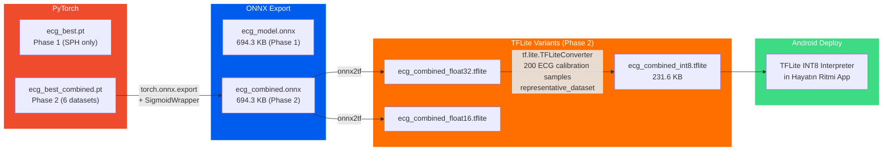

### Export File Details

| Format | File | Size | Input Shape | Input $\tau$ | Output $\tau$ | Phase |
|---|---|---:|---|:---:|:---:|:---:|
| PyTorch | `ecg_best.pt` | $726.4$ KB | $(B, 12, 2500)$ | float32 | float32 logits | 1 |
| PyTorch | `ecg_best_combined.pt` | $\sim\!726$ KB | $(B, 12, 2500)$ | float32 | float32 logits | 2 |
| ONNX | `ecg_model.onnx` | $694.3$ KB | $(B, 12, 2500)$ | float32 | float32 probs | 1 |
| ONNX | `ecg_combined.onnx` | $694.3$ KB | $(B, 12, 2500)$ | float32 | float32 probs | 2 |
| TFLite FP32 | `ecg_combined_float32.tflite` | $\sim\!698$ KB | $(1, 2500, 12)$ | float32 | float32 | 2 |
| TFLite FP16 | `ecg_combined_float16.tflite` | $\sim\!359$ KB | $(1, 2500, 12)$ | float32 | float32 | 2 |
| **TFLite INT8** | **`ecg_combined_int8.tflite`** | $\mathbf{231.6}$ **KB** | $(1, 2500, 12)$ | **int8** | **float32** | **2** |

**Quantization compression ratio:**

$$\text{CR}_{\text{INT8}} = \frac{\text{Size}_{\text{FP32}}}{\text{Size}_{\text{INT8}}} = \frac{698}{231.6} \approx 3.01\times$$

> **Note:** TFLite uses channels-last format $(B, T, L)$ vs PyTorch/ONNX channels-first $(B, L, T)$.

---

## 11. Speed Benchmarks

| Backend | $\bar{t}_{\text{latency}}$ | Throughput | Size |
|---|---:|---:|---:|
| GPU (RTX 4050) single | $1.94$ ms | $516$ ECG/s | $726$ KB |
| GPU batch=$32$ | $0.95$ ms | $33{,}810$ ECG/s | — |
| CPU (PyTorch) | $11.34$ ms | $88$ ECG/s | — |
| ONNX Runtime CPU | $4.56$ ms | $220$ ECG/s | $694$ KB |
| **TFLite INT8 CPU** | $\mathbf{0.84}$ **ms** | $\mathbf{1{,}185}$ **ECG/s** | $\mathbf{232}$ **KB** |
| TFLite FP16 CPU | $1.14$ ms | $878$ ECG/s | $359$ KB |
| TFLite FP32 CPU | $1.18$ ms | $846$ ECG/s | $698$ KB |

**Speedup of INT8 over PyTorch CPU:**

$$S = \frac{t_{\text{PyTorch}}}{t_{\text{INT8}}} = \frac{11.34}{0.84} \approx 13.5\times$$

---

## 12. Preprocessing Pipeline Detail

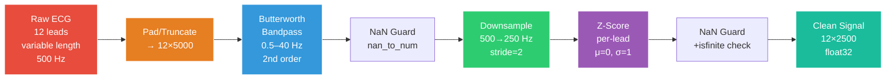

### Signal Processing Parameters

The preprocessing pipeline transforms raw ECG signals $\mathbf{x}_{\text{raw}} \in \mathbb{R}^{12 \times T}$ into normalized inputs $\mathbf{x} \in \mathbb{R}^{12 \times 2500}$.

**1. Butterworth Bandpass Filter** — 2nd order IIR with cutoff frequencies $f_L = 0.5\text{ Hz}$ and $f_H = 40\text{ Hz}$:

$$|H(j\omega)|^2 = \frac{1}{1 + \left(\frac{\omega}{\omega_c}\right)^{2n}} \qquad n = 2$$

The composite bandpass transfer function in the $z$-domain:

$$H_{\text{BP}}(z) = H_{\text{HP}}(z) \cdot H_{\text{LP}}(z)$$

Applied via `scipy.signal.butter(N=2, Wn=[0.5, 40], btype='band', fs=500)` with forward-backward filtering (`filtfilt`) for zero phase distortion.

**2. Downsampling** — from $f_s = 500\text{ Hz}$ to $f_{s}' = 250\text{ Hz}$:

$$\mathbf{x}_{\text{ds}}[n] = \mathbf{x}_{\text{bp}}[2n] \qquad n = 0, 1, \ldots, 2499$$

$$T_{\text{out}} = \left\lfloor \frac{T_0}{D} \right\rfloor = \frac{5000}{2} = 2500 \quad , \quad D = \frac{f_s}{f_s'} = 2$$

**3. Z-Score Normalization** — per-lead standardization:

$$\hat{x}_{\ell}[n] = \frac{x_{\ell}[n] - \mu_{\ell}}{\sigma_{\ell} + \epsilon} \qquad \text{where} \quad \mu_{\ell} = \frac{1}{T}\sum_{n=1}^{T} x_{\ell}[n] \;,\; \sigma_{\ell} = \sqrt{\frac{1}{T}\sum_{n=1}^{T}(x_{\ell}[n] - \mu_{\ell})^2}$$

for each lead $\ell \in \{1, \ldots, 12\}$, producing $\hat{\mathbf{x}} \sim \mathcal{N}(0, 1)$ per lead.

| Parameter | Value | Symbol |
|---|---|:---:|
| Original sampling rate | 500 Hz | $f_s$ |
| Target sampling rate | 250 Hz | $f_s'$ |
| Decimation factor | 2 | $D$ |
| Target duration | 10 seconds | $T_{\text{dur}}$ |
| Target samples | 2,500 per lead | $T = f_s' \cdot T_{\text{dur}}$ |
| Number of leads | 12 | $L$ |
| Bandpass filter | Butterworth, 2nd order | $n = 2$ |
| Low cutoff | 0.5 Hz | $f_L$ |
| High cutoff | 40 Hz | $f_H$ |
| Normalization | Per-lead Z-score | $\mu=0, \sigma=1$ |
| Padding | Zero-pad if $T_{\text{raw}} < T_0$ | $T_0 = 5000$ |
| Truncation | First $T_0$ samples if $T_{\text{raw}} > T_0$ | — |

---

## 13. Hardware & Environment

| Component | Specification |
|---|---|
| GPU | NVIDIA RTX 4050 Laptop, 6 GB VRAM |
| Driver | NVIDIA 560.94, CUDA 12.4 |
| Framework | PyTorch 2.6.0+cu124 |
| Python | 3.11 (conda: ecg_tf) |
| TensorFlow | 2.16.2 (CPU-only, for TFLite conversion) |
| ONNX Runtime | CPU backend |
| Phase 1 Dataset | SPH 12-Lead ECG (26,395 records) |
| Phase 2 Dataset | 6 combined datasets (64,778 records) |
| Phase 1 Training Time | ~20 epochs, early stopped |
| Phase 2 Training Time | ~45 epochs, early stopped at epoch 35 best |
| OS | Windows 11 |

---

## 14. File Inventory

```
ai/
├── training/
│   └── train_pytorch.py              # Phase 1 training script (SPH-only)
├── evaluation/
│   └── evaluate_cross_dataset.py     # Cross-dataset eval + Phase 2 retraining
├── export/
│   ├── export_tflite_int8.py         # Phase 1 INT8 quantization
│   └── export_combined_int8.py       # Phase 2 INT8 quantization
├── cache/
│   ├── dataset_cache.npz             # SPH preprocessed cache (~2.8 GB)
│   ├── cache_cpsc2018.npz            # CPSC 2018 cache (~666 MB)
│   ├── cache_cpsc2018-extra.npz      # CPSC 2018-Extra cache (~233 MB)
│   ├── cache_georgia.npz             # Georgia cache (~861 MB)
│   ├── cache_chapman-shaoxing.npz    # Chapman-Shaoxing cache (~796 MB)
│   └── cache_ningbo.npz             # Ningbo cache (~1,925 MB)
├── models/
│   ├── checkpoints/
│   │   ├── ecg_best.pt               # Phase 1 PyTorch weights (726 KB)
│   │   ├── ecg_best_combined.pt      # Phase 2 PyTorch weights
│   │   ├── ecg_model.onnx            # Phase 1 ONNX export (694 KB)
│   │   └── ecg_combined.onnx         # Phase 2 ONNX export (694 KB)
│   ├── results/
│   │   ├── evaluation_results.json        # Phase 1 test metrics
│   │   ├── tflite_evaluation_results.json # TFLite benchmark results
│   │   ├── cross_dataset_evaluation.json  # Phase 2 full results
│   │   ├── training_log.csv               # Phase 1 epoch-by-epoch
│   │   └── training_log_combined.csv      # Phase 2 epoch-by-epoch
│   └── tflite/
│       ├── ecg_model_float32.tflite       # Phase 1 FP32 (698 KB)
│       ├── ecg_model_float16.tflite       # Phase 1 FP16 (359 KB)
│       ├── ecg_model_int8.tflite          # Phase 1 INT8 (232 KB)
│       ├── ecg_combined_float32.tflite    # Phase 2 FP32
│       ├── ecg_combined_float16.tflite    # Phase 2 FP16
│       └── ecg_combined_int8.tflite       # Phase 2 INT8 (232 KB) ← Android target
└── scripts/
    └── debug_hea.py                       # Debugging utility

dataset/
├── download_ecg.py               # Multi-dataset CLI downloader (10 datasets)
├── ecg-arrhythmia/               # SPH dataset (~7 GB)
├── cpsc2018/                     # CPSC 2018 (~1 GB)
├── cpsc2018-extra/               # CPSC 2018-Extra (~0.5 GB)
├── georgia/                      # Georgia (~1.5 GB)
├── chapman-shaoxing/             # Chapman-Shaoxing (~1.5 GB)
├── ningbo/                       # Ningbo (~5 GB)
├── ptb-xl/                       # PTB-XL (~3 GB)
├── ptb/                          # PTB (~1.7 GB)
├── incart/                       # INCART (~794 MB)
└── ludb/                         # LUDB (~24 MB)
```
