# Hibrit Veritabani Mimarisi — Detayli Uygulama Plani

> **Hayatin Ritmi — TUBITAK Projesi**
> Tarih: 3 Mart 2026 | Versiyon: 1.0 | Durum: Uygulama plani (onay bekliyor)

---

## Icindekiler

1. [Mimari Genel Bakis](#1-mimari-genel-bakis)
2. [Veri Siniflandirmasi ve Depolama Karari](#2-veri-siniflandirmasi-ve-depolama-karari)
3. [EKG Veri Boyutu Analizi](#3-ekg-veri-boyutu-analizi)
4. [Faz 1 — Lokal Katman Iyilestirmeleri](#4-faz-1--lokal-katman-iyilestirmeleri)
5. [Faz 2 — Firebase Entegrasyonu](#5-faz-2--firebase-entegrasyonu)
6. [Faz 3 — Senkronizasyon Mekanizmasi](#6-faz-3--senkronizasyon-mekanizmasi)
7. [Faz 4 — EKG Dalga Verisi Yedekleme](#7-faz-4--ekg-dalga-verisi-yedekleme)
8. [Faz 5 — Doktor Paylasim ve Web Panel](#8-faz-5--doktor-paylasim-ve-web-panel)
9. [Faz 6 — Guvenlik ve KVKK](#9-faz-6--guvenlik-ve-kvkk)
10. [Faz 7 — Test ve Dogrulama](#10-faz-7--test-ve-dogrulama)
11. [Veritabani Semalari](#11-veritabani-semalari)
12. [Maliyet Takvimi](#12-maliyet-takvimi)

---

## 1. Mimari Genel Bakis

Hibrit mimari, verinin hassasiyet derecesine ve erisim gereksinimlerine gore iki katmana ayrilmasina dayanir. Saglik verisinin birincil kopyasi her zaman kullanicinin cihazinda kalir; sunucu yalnizca metadata yedegi ve paylasim icin kullanilir.

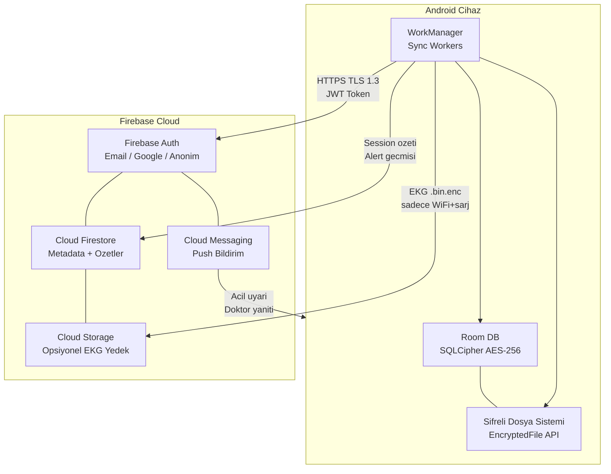

### Room DB Tablo Iliskileri

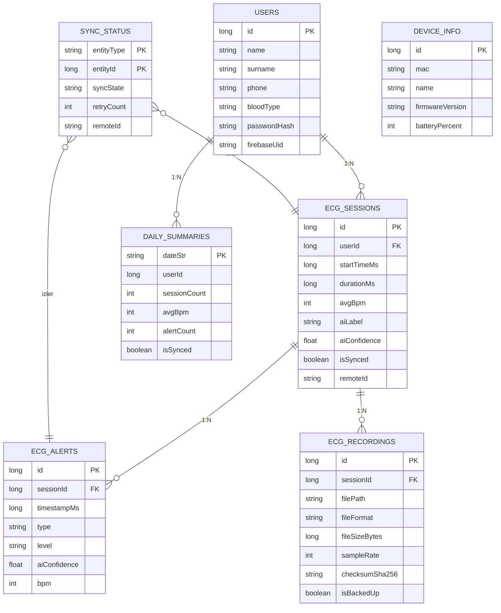

---

## 2. Veri Siniflandirmasi ve Depolama Karari

Her veri turunun nerede tutulacagini belirleyen karar kriterleri asagidaki tabloda ozetlenmistir.

| Veri Turu | Boyut/Kayit | Erisim Sikligi | Hassasiyet | Lokal | Sunucu | Gerekce |
|-----------|------------|----------------|------------|:-----:|:------:|---------|
| Ham EKG dalga verisi | 60-120 KB/dk | Yuksek (gosterim) | Cok Yuksek | X | - | Bant genisligi ve gizlilik |
| AI inference sonucu | <1 KB | Anlik | Orta | X | - | Latency kritik |
| Session metadata | <1 KB | Dusuk | Orta | X | X | Doktor erisimi, yedek |
| Alert gecmisi | <0.5 KB | Acil | Yuksek | X | X | Acil durum takibi |
| Kullanici profili | <2 KB | Dusuk | Yuksek | X | X | Cihaz degisimi |
| Gunluk ozet | <0.5 KB | Raporlama | Dusuk | X | X | Trend analizi |
| Cihaz bilgisi | <0.2 KB | Baglantida | Dusuk | X | - | Sadece lokal anlamli |
| EKG dalga yedegi | 60-120 KB/dk | Nadiren | Cok Yuksek | X | Opsiyonel | Kullanici izniyle |

### Karar Algoritmasi

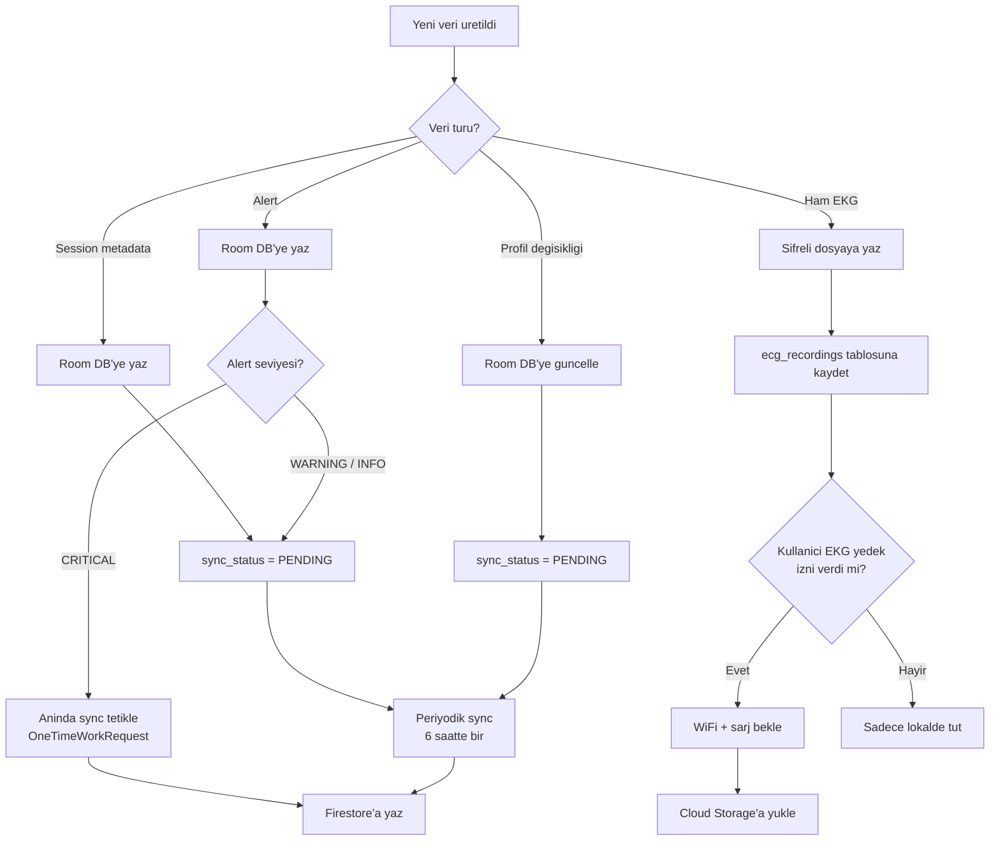

---

## 3. EKG Veri Boyutu Analizi

### Temel Parametreler

Cihaz spesifikasyonlari:

| Parametre | Deger |
|-----------|-------|
| Kanal sayisi (C) | 2 |
| Ornekleme frekansi (fs) | 250 Hz veya 500 Hz |
| Bit derinligi (b) | 16 bit = 2 byte |
| Sikistirma | Yok (ham binary) |

### Veri Hizi Hesabi

Saniye basina veri hizi:

    R = C x fs x b

    250 Hz icin:  R = 2 x 250 x 2 = 1,000 byte/s = 1.0 KB/s
    500 Hz icin:  R = 2 x 500 x 2 = 2,000 byte/s = 2.0 KB/s

### Depolama Gereksinimi Tablosu

| Senaryo | Gunluk Kayit Suresi | 250 Hz | 500 Hz |
|---------|-------------------|--------|--------|
| Spot check (3 x 1 dk) | 3 dk | 180 KB | 360 KB |
| Duzenli kullanim (30 dk) | 30 dk | 1.8 MB | 3.6 MB |
| Uzun monitorizasyon (2 saat) | 120 dk | 7.2 MB | 14.4 MB |
| Holter modu (24 saat) | 1,440 dk | 86.4 MB | 172.8 MB |

### Aylik Birikimli Depolama

| Kullanici Profili | Aylik Lokal | Aylik Bulut (metadata) | Aylik Bulut (EKG dahil) |
|-------------------|------------|----------------------|------------------------|
| Gunluk spot check | ~5 MB | <100 KB | ~5 MB |
| Duzenli kullanim | ~54 MB | <100 KB | ~54 MB |
| Holter modu | ~2.6 GB | <100 KB | ~2.6 GB |

### Olcekleme: N Kullanici icin Sunucu Maliyeti

Sadece metadata sync edildigi senaryoda:

    M_metadata(N) = N x 100 KB/ay

    1,000 kullanici:  100 MB/ay  (ihmal edilebilir)
    10,000 kullanici: 1 GB/ay    (ihmal edilebilir)

EKG dalga verisi de dahil edildiginde (duzenli kullanici profili):

    M_waveform(N) = N x 54 MB/ay

    1,000 kullanici:  54 GB/ay
    10,000 kullanici: 540 GB/ay

Bu hesaplar, EKG dalga verisinin sadece metadata degerinde oldugunu ve bulut yedeklemenin opsiyonel tutulmasinin maliyet acisindan kritik oldugunu gostermektedir.

---

## 4. Faz 1 — Lokal Katman Iyilestirmeleri

**Sure tahmini**: 3-4 gun  
**Bagimlilik**: Yok

### 4.1 Yeni Room Entity Tanimlari

- [ ] **4.1.1** `SyncStatusEntity` sinifi olustur

| Alan | Tip | Aciklama |
|------|-----|----------|
| entityType | String (PK) | "session", "alert", "profile" |
| entityId | Long (PK) | Lokal Room row ID |
| syncState | String | PENDING, SYNCING, SYNCED, FAILED |
| lastSyncAttemptMs | Long | Son deneme zamani |
| lastSyncSuccessMs | Long | Son basarili sync |
| retryCount | Int | Deneme sayaci |
| errorMessage | String? | Hata mesaji |
| remoteId | String? | Firestore document ID |

- [ ] **4.1.2** `EcgRecordingEntity` sinifi olustur

| Alan | Tip | Aciklama |
|------|-----|----------|
| id | Long (PK, auto) | Otomatik artan ID |
| sessionId | Long (FK) | Bagli session |
| filePath | String | recordings/2026-03-03_xxx.bin |
| fileFormat | String | BIN_INT16_LE, CSV, PDF |
| fileSizeBytes | Long | Dosya boyutu |
| sampleRate | Int | 250 veya 500 Hz |
| channelCount | Int | 2 (gogus bandi) |
| durationMs | Long | Kayit suresi |
| checksumSha256 | String | Butunluk dogrulama |
| isBackedUp | Boolean | Buluta yedeklendi mi |
| backupUri | String? | Cloud Storage URI |
| createdAt | Long | Olusturma zamani |

- [ ] **4.1.3** `DailySummaryEntity` sinifi olustur

| Alan | Tip | Aciklama |
|------|-----|----------|
| dateStr | String (PK) | "2026-03-03" formati |
| userId | Long | Kullanici ID |
| totalRecordingMs | Long | Toplam kayit suresi |
| sessionCount | Int | Oturum sayisi |
| avgBpm / minBpm / maxBpm | Int | BPM istatistikleri |
| alertCount | Int | Toplam uyari |
| criticalAlertCount | Int | Kritik uyari sayisi |
| avgQualityScore | Int | Ortalama sinyal kalitesi |
| dominantAiLabel | String | En sik AI etiketi |
| isSynced | Boolean | Sunucuya gonderildi mi |

- [ ] **4.1.4** Mevcut `EcgSessionEntity`'ye sync alanlari ekle

| Yeni Alan | Tip | Varsayilan |
|-----------|-----|-----------|
| isSynced | Boolean | false |
| remoteId | String? | null |
| syncedAt | Long? | null |

- [ ] **4.1.5** Mevcut `UserEntity`'ye Firebase alani ekle

| Yeni Alan | Tip | Varsayilan |
|-----------|-----|-----------|
| firebaseUid | String? | null |

### 4.2 Yeni DAO Arayuzleri

- [ ] **4.2.1** `SyncStatusDao` — getPendingItems, markAttempted, markSynced, cleanOldSynced
- [ ] **4.2.2** `EcgRecordingDao` — getBySession, getUnbackedUp, insert, markBackedUp, getTotalStorageBytes
- [ ] **4.2.3** `DailySummaryDao` — getRecent, upsert, getUnsynced
- [ ] **4.2.4** Mevcut `EcgSessionDao`'ya ekle: getById, markSynced, getSessionsInRange

### 4.3 Room Migration

- [ ] **4.3.1** `Migration_1_2` sinifi yaz (3 yeni tablo + 3 ALTER TABLE)
- [ ] **4.3.2** `DatabaseModule`'den `fallbackToDestructiveMigration()` ifadesini kaldir
- [ ] **4.3.3** `addMigrations(MIGRATION_1_2)` ekle
- [ ] **4.3.4** Migration test yaz (`MigrationTestHelper` kullanarak)

### 4.4 Sifreli Dosya Depolama

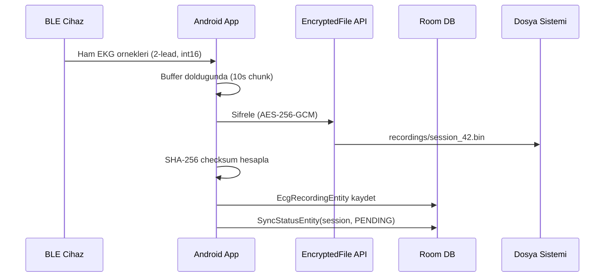

- [ ] **4.4.1** `EncryptedRecordingStorage` sinifi olustur
- [ ] **4.4.2** Dosya formati tanimla (header + data)

**Dosya Formati (Binary)**:

| Offset | Boyut | Icerik |
|--------|-------|--------|
| 0 | 4 byte | sampleRate (int32 LE) |
| 4 | 4 byte | channelCount (int32 LE) |
| 8 | 8 byte | sampleCount (int64 LE) |
| 16 | N byte | interleaved int16 LE samples |

- [ ] **4.4.3** `RecordingResult` ve `EcgWaveformData` data class'lari olustur
- [ ] **4.4.4** Eski `filePath` tabanli sistemi yeni yapiya migrate et

### 4.5 Otomatik Gunluk Ozet Hesaplama

- [ ] **4.5.1** `CalculateDailySummaryUseCase` sinifi olustur
- [ ] **4.5.2** Hesaplama algoritmasi:

**Algoritma: Gunluk Ozet Hesaplama**

| Adim | Islem | Girdi | Cikti |
|------|-------|-------|-------|
| 1 | Tarih araligini belirle | date | startMs, endMs |
| 2 | Session'lari sorgula | userId, startMs, endMs | sessions[] |
| 3 | Alert'leri sorgula | startMs, endMs | alerts[] |
| 4 | Toplam sure hesapla | sessions[].durationMs | totalRecordingMs |
| 5 | BPM istatistikleri | sessions[].avgBpm | avg, min, max |
| 6 | Alert sayimi | alerts[].level | alertCount, criticalCount |
| 7 | Baskin AI etiketi | sessions[].aiLabel | groupBy -> maxBy |
| 8 | DB'ye yaz | DailySummaryEntity | upsert |

- [ ] **4.5.3** Gece yarisi (00:05) otomatik tetikleme icin WorkManager job'i ekle

---

## 5. Faz 2 — Firebase Entegrasyonu

**Sure tahmini**: 4-5 gun  
**Bagimlilik**: Firebase Console'da proje olusturulmus olmali

### 5.1 Firebase Proje Kurulumu

- [ ] **5.1.1** Firebase Console'da proje olustur: `hayatin-ritmi`
- [ ] **5.1.2** Android uygulamasini kaydet: `com.hayatinritmi.app`
- [ ] **5.1.3** `google-services.json` dosyasini `mobile/app/` altina koy
- [ ] **5.1.4** Firestore'u etkinlestir (location: `europe-west1`)
- [ ] **5.1.5** Cloud Storage'i etkinlestir (ayni region)
- [ ] **5.1.6** Authentication provider'lari etkinlestir: Email/Password, Google Sign-In, Anonymous

### 5.2 Gradle Bagimliliklari

- [ ] **5.2.1** Project-level `build.gradle.kts`'ye Google Services plugin ekle
- [ ] **5.2.2** App-level `build.gradle.kts`'ye Firebase BoM ve kutuphaneler ekle:

| Kutuphane | Amac |
|-----------|------|
| firebase-auth-ktx | Kullanici kimlik dogrulama |
| firebase-firestore-ktx | Metadata depolama |
| firebase-storage-ktx | EKG dosya yedekleme |
| firebase-messaging-ktx | Push bildirim |
| firebase-analytics-ktx | Kullanim analitigi |

### 5.3 Firebase Auth Entegrasyonu

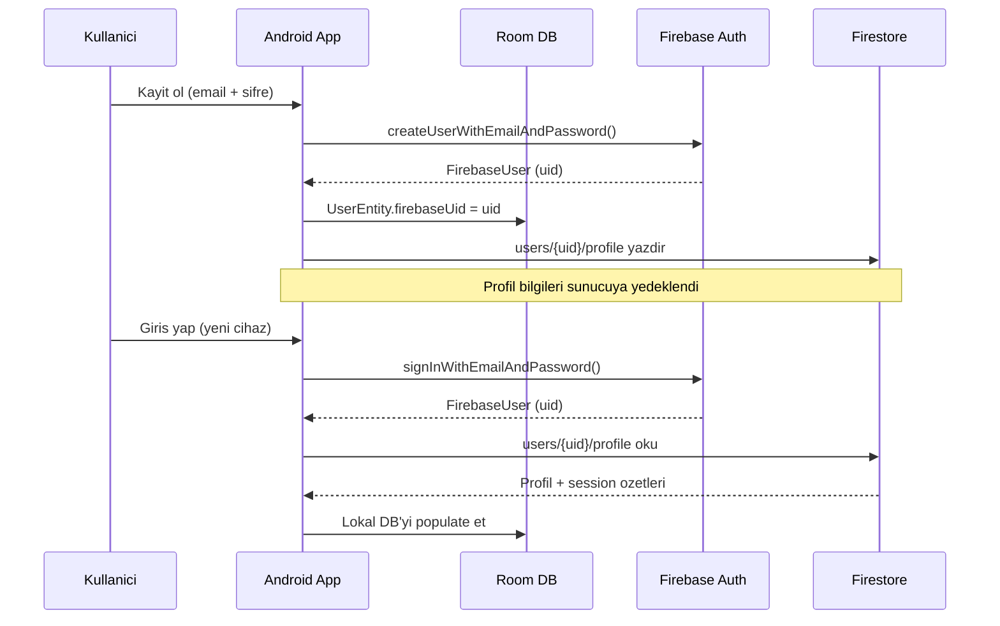

- [ ] **5.3.1** `AuthRepository` interface olustur
- [ ] **5.3.2** `AuthRepositoryImpl` implement et (signUp, signIn, signOut, delete, passwordReset)
- [ ] **5.3.3** `AuthModule` Hilt DI modulu olustur
- [ ] **5.3.4** Mevcut `LoginScreen` ve `SignUpScreen`'i Firebase Auth'a bagla
- [ ] **5.3.5** Room `UserEntity` ile Firebase UID eslestir
- [ ] **5.3.6** Ilk giris: Room'daki lokal kullaniciyi Firebase'e migrate et

### 5.4 Firestore Veri Modelleri

- [ ] **5.4.1** Firestore guvenlik kurallarini yaz (kullanici sadece kendi verisine erisebilir)
- [ ] **5.4.2** `RemoteUserProfile` data class olustur
- [ ] **5.4.3** `RemoteSessionSummary` data class olustur
- [ ] **5.4.4** `RemoteAlert` data class olustur
- [ ] **5.4.5** `RemoteDailySummary` data class olustur
- [ ] **5.4.6** `FirestoreRepository` sinifi olustur (CRUD operasyonlari)

### Firestore Koleksiyon Yapisi

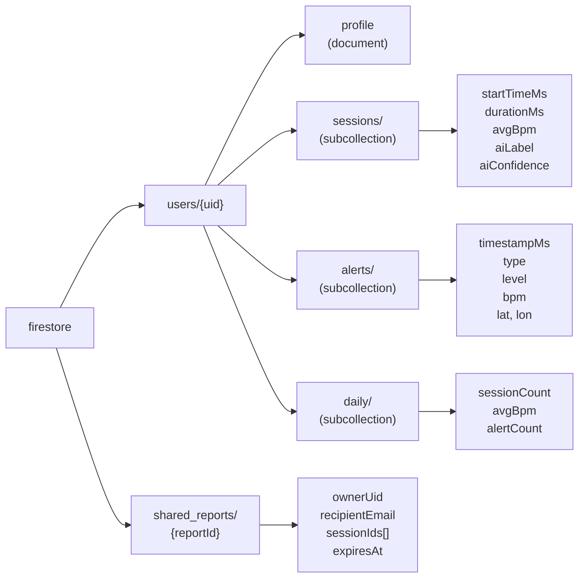

---

## 6. Faz 3 — Senkronizasyon Mekanizmasi

**Sure tahmini**: 4-5 gun  
**Bagimlilik**: Faz 1 + Faz 2 tamamlanmis olmali

### 6.1 Sync Oncelik Stratejisi

| Oncelik | Veri Turu | Tetikleme | Network Gereksinimi | Periyot |
|---------|-----------|-----------|-------------------|---------|
| 1 (en yuksek) | Critical Alert | Aninda | Hucresel veya WiFi | Olay bazli |
| 2 | Session ozeti | Periyodik | Hucresel veya WiFi | 6 saatte bir |
| 3 | Profil backup | Degistiginde | Hucresel veya WiFi | Olay bazli |
| 4 | Gunluk ozet | Gece yarisi | Hucresel veya WiFi | Gunde 1 |
| 5 (en dusuk) | EKG waveform | WiFi + sarj | Sadece WiFi | Gunde 1 |

### 6.2 Retry Algoritmasi

Basarisiz sync denemeleri icin ustel geri cekilme (exponential backoff) stratejisi uygulanir.

**Bekleme suresi hesabi:**

    T_wait(n) = min(T_base x 2^n, T_max)

    T_base = 1 dakika
    T_max  = 6 saat
    n      = deneme sayisi (0-indexed)

| Deneme (n) | Bekleme Suresi | Kumulatif |
|------------|---------------|-----------|
| 0 | 1 dk | 1 dk |
| 1 | 2 dk | 3 dk |
| 2 | 4 dk | 7 dk |
| 3 | 8 dk | 15 dk |
| 4 | 16 dk | 31 dk |
| 5 | 32 dk | 63 dk |
| 6 | 64 dk | 127 dk |
| 7 | 128 dk | 255 dk |
| 8 | 256 dk | 511 dk |
| 9 | 360 dk (max) | 871 dk |
| 10 | DURDUR | Kullaniciya bildir |

### 6.3 Sync Durum Makinesi

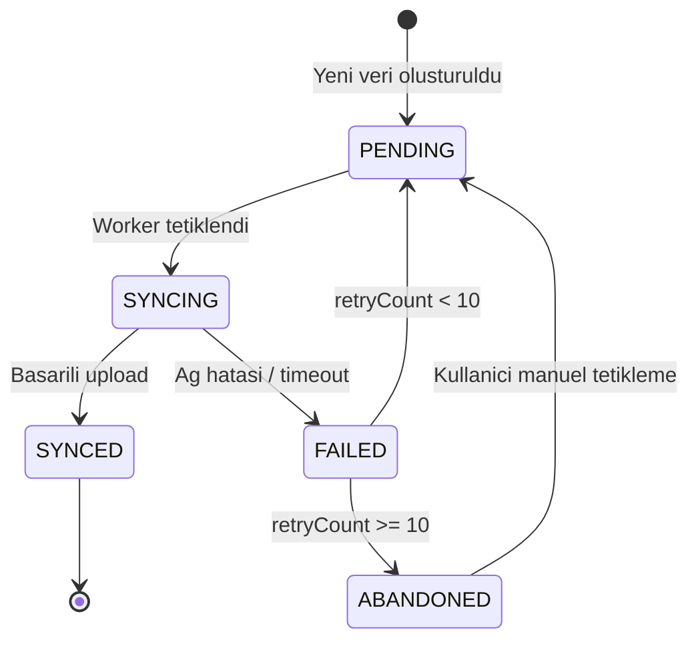

### 6.4 Worker Mimarisi

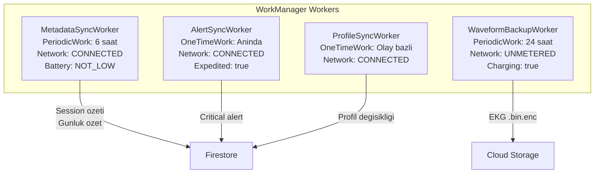

- [ ] **6.4.1** Mevcut `SessionSyncWorker` yapisini `MetadataSyncWorker` olarak yeniden yaz
- [ ] **6.4.2** `AlertSyncWorker` olustur (OneTimeWork, expedited)
- [ ] **6.4.3** `ProfileSyncWorker` olustur
- [ ] **6.4.4** `WaveformBackupWorker` olustur (Faz 4'te detaylandirilacak)

### 6.5 Calisma Akisi: MetadataSyncWorker

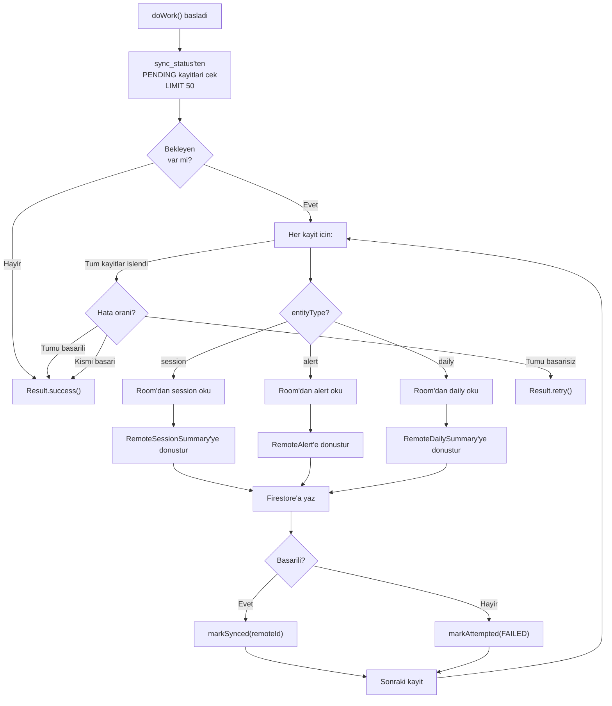

- [ ] **6.4.5** `SyncScheduler` sinifini guncelle (4 worker icin ayri schedule fonksiyonlari)

### 6.6 Cakisma Cozumu (Conflict Resolution)

**Strateji: Local-First, Last-Write-Wins**

| Senaryo | Cozum |
|---------|-------|
| Ayni session iki cihazdan sync | En son `lastSyncedAt` kazanir |
| Sunucu verisi lokal veriden yeni | Sunucu verisini al (profil icin) |
| Lokal veri sunucu verisinden yeni | Lokal veriyi gondeur |
| Cihaz degisimi | Firestore'dan profil + ozetler cekilir; ham EKG tasinmaz |

- [ ] **6.6.1** `ConflictResolver` sinifi olustur
- [ ] **6.6.2** Multi-device senaryo test plani yaz

### 6.7 Sync Durumu UI

- [ ] **6.7.1** `SyncStatusViewModel` olustur
- [ ] **6.7.2** `SettingsScreen`'e senkronizasyon bolumu ekle

**SettingsScreen Sync Bolumu Tasarimi:**

| Bilesen | Icerik |
|---------|--------|
| Son sync | Tarih ve saat (orn: 14:30, 2 saat once) |
| Bekleyen | N session, M alert |
| Toplam | K kayit senkronize edildi |
| Buton | "Simdi Senkronize Et" |
| Toggle | "EKG Dalga Yedekleme" acik/kapali |
| Bilgi | "WiFi gerekli, tahmini ~54 MB/ay" |

- [ ] **6.7.3** Sync hata bildirimi (notification) ekle

---

## 7. Faz 4 — EKG Dalga Verisi Yedekleme

**Sure tahmini**: 3 gun  
**Bagimlilik**: Faz 3 tamamlanmis olmali  
**Tetikleme**: Kullanici ayarlardan toggle acarsa

### 7.1 Cloud Storage Yapisi

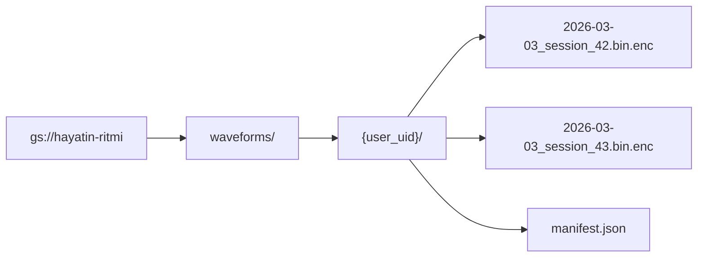

### 7.2 Upload Akisi

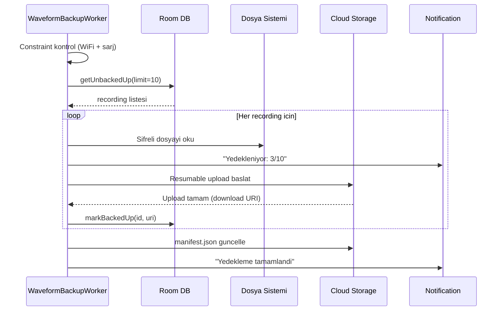

- [ ] **7.2.1** `WaveformBackupWorker` olustur
- [ ] **7.2.2** Upload progress tracking (foreground notification)
- [ ] **7.2.3** `WaveformRestoreWorker` olustur (cihaz degisiminde geri yukleme)

### 7.3 Depolama Limitleri

| Parametre | Deger |
|-----------|-------|
| Kullanici basi limit | 2 GB |
| Tek dosya max boyut | 200 MB |
| Uyari esigi | %80 (1.6 GB) |
| Tam dolum esigi | %100 (2 GB) |
| Tam dolumda eylem | Eski kayitlari silme onerisi |

- [ ] **7.3.1** Storage Security Rules yaz
- [ ] **7.3.2** Depolama limiti uyari mekanizmasi ekle

---

## 8. Faz 5 — Doktor Paylasim ve Web Panel

**Sure tahmini**: 5-7 gun  
**Bagimlilik**: Faz 3 tamamlanmis olmali  
**Oncelik**: Dusuk (prototip sonrasi)

### 8.1 Paylasim Akisi

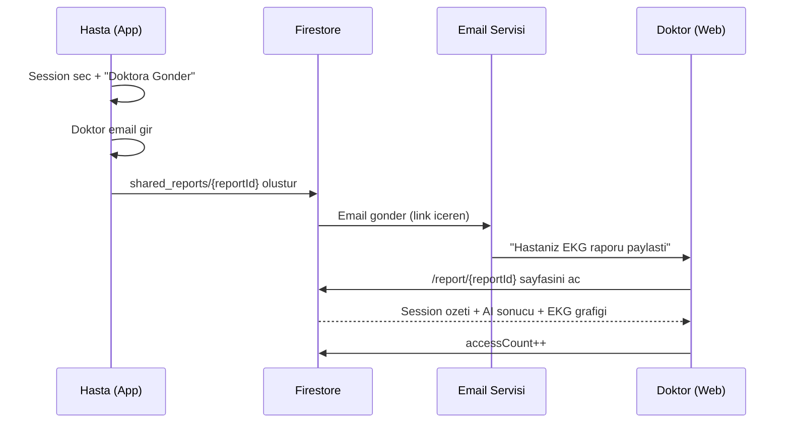

- [ ] **8.1.1** `SharedReport` modeli olustur
- [ ] **8.1.2** Paylasim URL formati: `https://hayatinritmi.web.app/report/{reportId}`
- [ ] **8.1.3** `ReportsScreen`'de paylasim butonu ekle

### 8.2 Doktor Web Paneli

- [ ] **8.2.1** Basit web sayfasi (Firebase Hosting)
- [ ] **8.2.2** Rapor gorunum sayfasi: Hasta inisyali, BPM, AI sonuclari, EKG grafigi, PDF indirme
- [ ] **8.2.3** Link son kullanma (expiry) mekanizmasi

### 8.3 Paylasimda Minimum Veri Ilkesi

| Paylasilan | Paylasilmayan |
|------------|--------------|
| AI sonucu ve guven skoru | Tam isim (sadece inisyal) |
| BPM istatistikleri | Telefon numarasi |
| EKG grafigi (varsa) | Adres |
| Session tarihi ve suresi | Diger saglik verileri |

---

## 9. Faz 6 — Guvenlik ve KVKK

**Sure tahmini**: 2-3 gun  
**Bagimlilik**: Tum fazlar

### 9.1 Veri Sifreleme Katmanlari

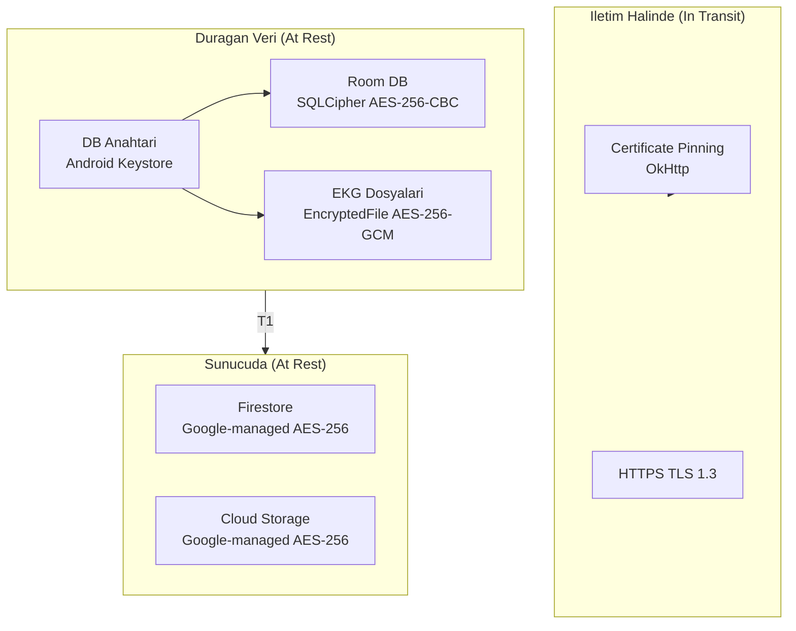

- [ ] **9.1.1** Certificate pinning ekle (OkHttp interceptor)
- [ ] **9.1.2** Network security config dosyasi olustur (cleartext trafik engelle)

### 9.2 KVKK Uyumluluk Kontrol Listesi

- [ ] **9.2.1** Uygulama ilk acilista KVKK aydinlatma metni goster
- [ ] **9.2.2** Acik riza formu (checkbox'lar):
  - [ ] "Saglik verilerimin islenmesini kabul ediyorum"
  - [ ] "Verilerimin bulutta yedeklenmesini kabul ediyorum" (opsiyonel)
  - [ ] "Acil durumlarda konum bilgimin paylasilmasini kabul ediyorum"
- [ ] **9.2.3** "Verilerimi Sil" butonu (KVKK md. 11 — silme hakki)

**Silme Algoritmasi:**

| Adim | Islem | Hedef |
|------|-------|-------|
| 1 | Firestore kullanici dokumanlari | users/{uid}/** |
| 2 | Cloud Storage dosyalari | waveforms/{uid}/** |
| 3 | Firebase Auth hesabi | Authentication |
| 4 | Lokal Room DB | hayatinritmi.db |
| 5 | Lokal dosyalar | recordings/* |
| 6 | SharedPreferences | db_key_prefs, ayarlar |

- [ ] **9.2.4** Veri export butonu (KVKK md. 11 — tasinabilirlik hakki, JSON formati)
- [ ] **9.2.5** Otomatik veri silme politikasi:

| Gun | Eylem |
|-----|-------|
| 90 | Kullanilmayan hesap uyari email'i |
| 180 | Veri silme bildirimi |
| 210 | Otomatik silme |

### 9.3 Veri Lokasyonu

| Asama | Lokasyon | KVKK Durumu |
|-------|---------|-------------|
| Prototip | Firebase EU (europe-west1) | Acik riza ile uyumlu |
| Pilot | Firebase EU | Acik riza ile uyumlu |
| Urun | Turkiye'de self-host | Tam uyumlu |

---

## 10. Faz 7 — Test ve Dogrulama

**Sure tahmini**: 3-4 gun  
**Bagimlilik**: Ilgili fazin tamamlanmasi

### 10.1 Test Matrisi

| Test Kategorisi | Test Sayisi | Kapsam |
|----------------|------------|--------|
| Unit testler | 15-20 | DAO, UseCase, Repository |
| Entegrasyon testleri | 8-10 | Sync akisi, multi-device |
| Guvenlik testleri | 5-6 | Sifreleme, yetkilendirme |
| Performans testleri | 4-5 | Sorgu, bellek, pil |

### 10.2 Unit Testler

- [ ] **10.2.1** `SyncStatusDao` testleri (CRUD, durum gecisleri)
- [ ] **10.2.2** `EcgRecordingDao` testleri (insert, backup, storage hesabi)
- [ ] **10.2.3** `DailySummaryDao` testleri (upsert, unsynced sorgulari)
- [ ] **10.2.4** `CalculateDailySummaryUseCase` testleri (BPM hesaplari, bos veri)
- [ ] **10.2.5** `ConflictResolver` testleri (last-write-wins senaryolari)
- [ ] **10.2.6** Room migration testleri (`MigrationTestHelper`)

### 10.3 Entegrasyon Testleri

| Senaryo | Adimlar | Beklenen Sonuc |
|---------|---------|----------------|
| Offline-Online sync | 1. Airplane mode, 5 session kaydet. 2. WiFi ac. 3. Dogrula. | Tum session'lar Firestore'da |
| Multi-device | 1. Cihaz A: hesap + 3 session. 2. Cihaz B: giris. | Ozetler B'ye gelir, EKG gelmez |
| Buyuk veri | 1000 session olustur, sync performansini olc | Batch write limitleri asmasiz |
| Ag kesintisi | Upload sirasinda WiFi kapat | Worker retry ile tamamlar |
| Migration | v1 DB olustur, v2'ye migrate et | Veri kaybi yok |

### 10.4 Guvenlik Testleri

- [ ] **10.4.1** SQLCipher dogrulama: DB dosyasini hex editor ile ac, sifreli oldugunu teyit et
- [ ] **10.4.2** EncryptedFile dogrulama: .bin dosyasini direkt okumaya calis, okunamaz olmali
- [ ] **10.4.3** Firestore rules testi: Baska kullanicinin verisine erisim denemesi, reddedilmeli
- [ ] **10.4.4** Firebase App Check entegrasyonu (bot korumasi)

### 10.5 Performans Testleri

| Metrik | Hedef | Olcum Yontemi |
|--------|-------|--------------|
| Room sorgu suresi (10K session) | < 100 ms | Android Profiler |
| Sync worker bellek kullanimi | < 50 MB | Android Profiler |
| Upload hizi (1 MB dosya, WiFi) | < 5 s | Zamanlayici |
| Pil tuketimi (6 saat sync periyodu) | < %1/gun | Battery Historian |

---

## 11. Veritabani Semalari

### 11.1 Room (Lokal) — Tam Sema

**Mevcut Tablolar (guncellendi):**

| Tablo | Sutun | Tip | Kisitlama | Yeni mi? |
|-------|-------|-----|-----------|----------|
| users | id | INTEGER | PK AUTO | - |
| users | name, surname, phone | TEXT | NOT NULL | - |
| users | bloodType | TEXT | DEFAULT '' | - |
| users | emergencyContactName/Phone | TEXT | DEFAULT '' | - |
| users | passwordHash, salt | TEXT | NOT NULL | - |
| users | firebaseUid | TEXT | NULLABLE | Evet |
| ecg_sessions | id | INTEGER | PK AUTO | - |
| ecg_sessions | userId | INTEGER | FK -> users | - |
| ecg_sessions | startTimeMs, durationMs | INTEGER | NOT NULL | - |
| ecg_sessions | avgBpm, minBpm, maxBpm | INTEGER | DEFAULT 0 | - |
| ecg_sessions | aiLabel | TEXT | DEFAULT '' | - |
| ecg_sessions | aiConfidence | REAL | DEFAULT 0 | - |
| ecg_sessions | isSynced | INTEGER | DEFAULT 0 | Evet |
| ecg_sessions | remoteId | TEXT | NULLABLE | Evet |
| ecg_sessions | syncedAt | INTEGER | NULLABLE | Evet |

**Yeni Tablolar:**

| Tablo | Sutun | Tip | Kisitlama |
|-------|-------|-----|-----------|
| sync_status | entityType | TEXT | PK |
| sync_status | entityId | INTEGER | PK |
| sync_status | syncState | TEXT | DEFAULT 'PENDING' |
| sync_status | retryCount | INTEGER | DEFAULT 0 |
| sync_status | remoteId | TEXT | NULLABLE |
| ecg_recordings | id | INTEGER | PK AUTO |
| ecg_recordings | sessionId | INTEGER | FK -> ecg_sessions |
| ecg_recordings | filePath | TEXT | NOT NULL |
| ecg_recordings | fileSizeBytes | INTEGER | NOT NULL |
| ecg_recordings | sampleRate | INTEGER | NOT NULL |
| ecg_recordings | checksumSha256 | TEXT | NOT NULL |
| ecg_recordings | isBackedUp | INTEGER | DEFAULT 0 |
| daily_summaries | dateStr | TEXT | PK |
| daily_summaries | userId | INTEGER | NOT NULL |
| daily_summaries | sessionCount | INTEGER | DEFAULT 0 |
| daily_summaries | avgBpm | INTEGER | DEFAULT 0 |
| daily_summaries | alertCount | INTEGER | DEFAULT 0 |
| daily_summaries | isSynced | INTEGER | DEFAULT 0 |

---

## 12. Maliyet Takvimi

### 12.1 Gelistirme Suresi

| Faz | Aciklama | Sure | Bagimlilik |
|-----|----------|------|------------|
| 1 | Lokal katman iyilestirmeleri | 3-4 gun | - |
| 2 | Firebase entegrasyonu | 4-5 gun | Firebase Console |
| 3 | Sync mekanizmasi | 4-5 gun | Faz 1 + 2 |
| 4 | EKG dalga yedekleme | 3 gun | Faz 3 |
| 5 | Doktor paylasim + web | 5-7 gun | Faz 3 |
| 6 | Guvenlik + KVKK | 2-3 gun | Tum fazlar |
| 7 | Test + dogrulama | 3-4 gun | Ilgili faz |
| **Toplam** | | **25-30 gun** | |

### 12.2 Gantt Diyagrami

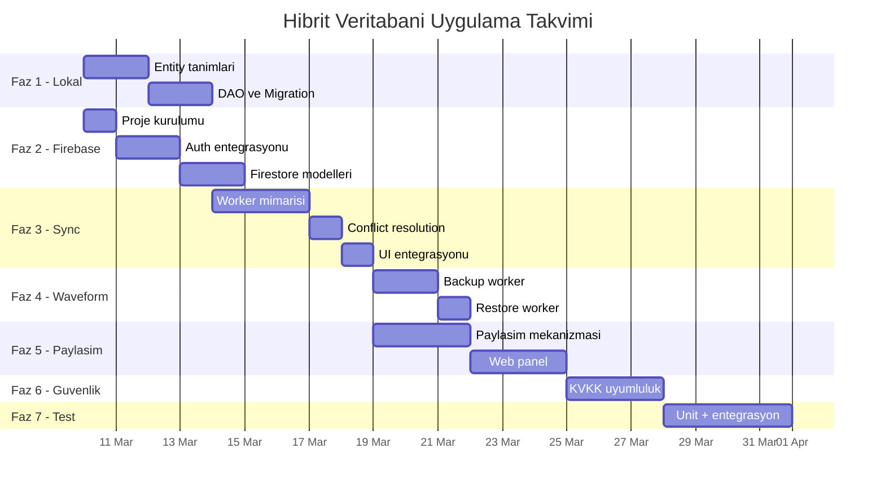

### 12.3 Aylik Isletme Maliyeti

| Kullanici Sayisi | Firebase Firestore | Cloud Storage | Toplam |
|-------------------|-------------------|---------------|--------|
| 100 (prototip) | $0 (ucretsiz tier) | $0 | $0/ay |
| 500 (pilot) | $0 | $0 | $0/ay |
| 1,000 | ~$5 | ~$3 | ~$8/ay |
| 5,000 | ~$25 | ~$15 | ~$40/ay |
| 10,000 | ~$50 | ~$50 | ~$100/ay |

> **Not**: Sadece metadata sync edildigi senaryoda (EKG waveform haric), prototip ve pilot asamalarinda maliyet tamamen sifirdir. Firebase Spark (ucretsiz) plani yeterlidir.

---

## Hemen Baslanabilecek Adimlar

- [ ] Firebase Console'da proje olustur
- [ ] `google-services.json` dosyasini al
- [ ] Faz 1.1-1.3: Yeni Room entity'leri olustur
- [ ] Faz 1.4: Migration yaz ve test et
- [ ] Faz 2.2: Gradle bagimliliklerini ekle
