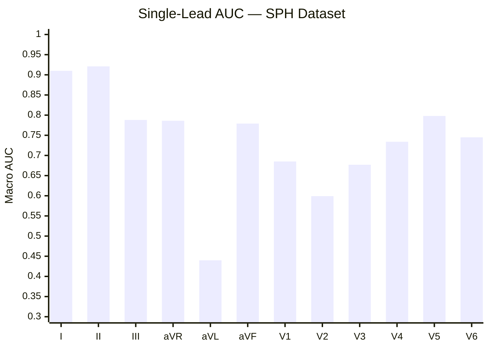
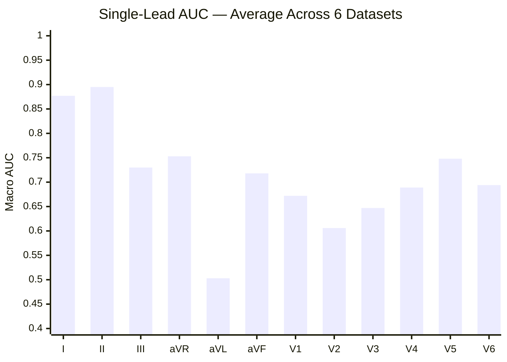
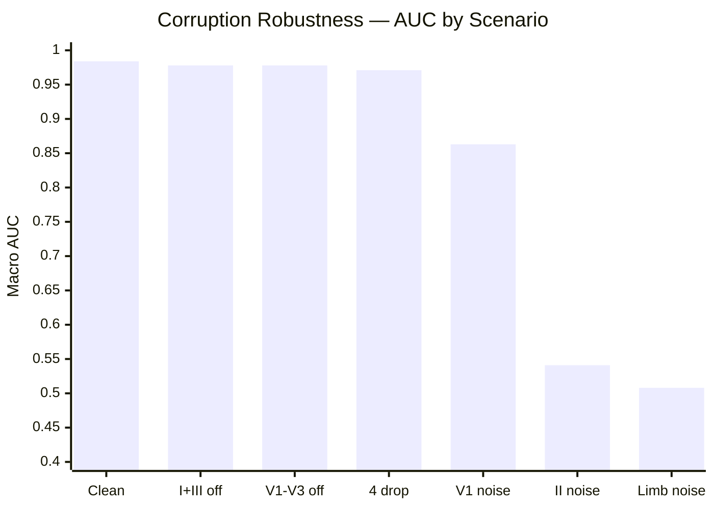
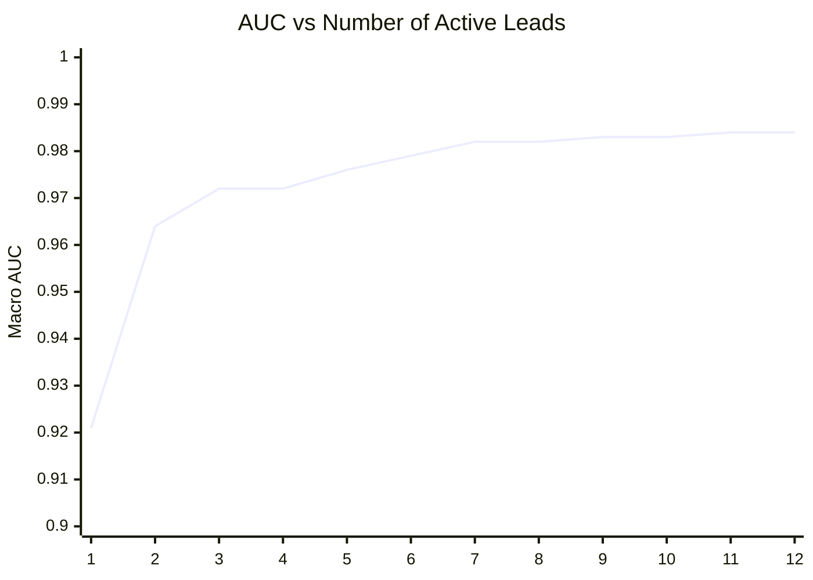
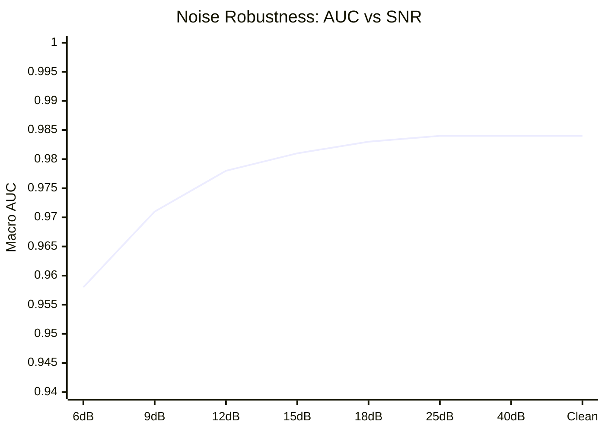
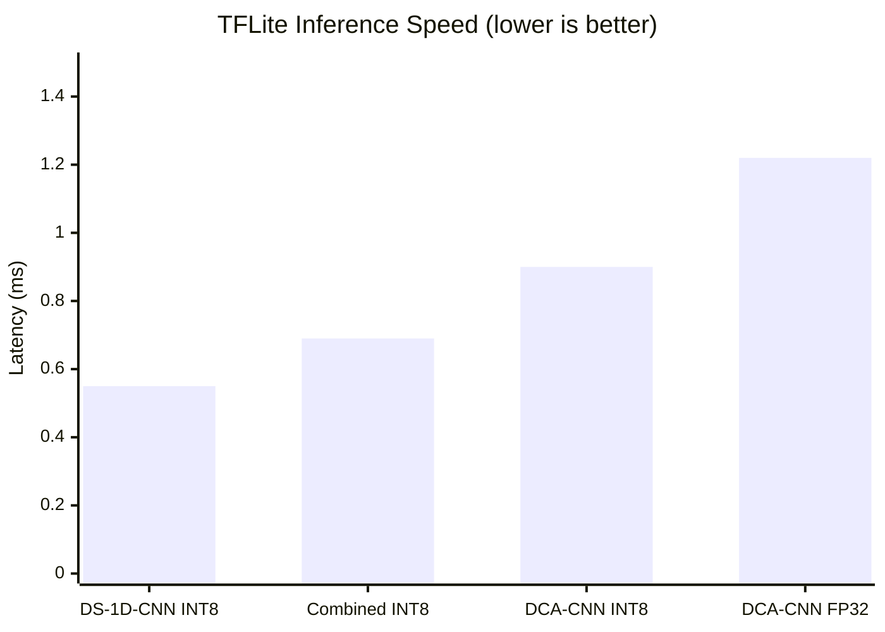

# Master Implementation Status & Remaining Work

> **Tarih:** 28 Şubat 2026
> **Son Güncelleme:** 28 Şubat 2026 — tüm AI bileşenleri tamamlandı
> **Referans:** TÜBİTAK 2209-A Araştırma Önerisi (research_proposal.txt)

---

## 1. TAMAMLANAN İŞLER

### 1.1 — Model Geliştirme Pipeline

| # | Bileşen | Durum | Metrik | Dosya |
|---|---------|-------|--------|-------|
| 1 | DS-1D-CNN eğitimi (SPH, 26K) | ✅ | AUC 0.9517 | `ai/training/train_pytorch.py` |
| 2 | DS-1D-CNN combined retrain (6 dataset, 54K) | ✅ | AUC 0.9621 | `ai/evaluation/evaluate_cross_dataset.py` |
| 3 | **DCA-CNN eğitimi (ACC+SE+gates+phase reg)** | ✅ | AUC 0.9513, 261K param | `ai/training/train_dca_cnn.py` |
| 4 | DCA-CNN QAT fine-tuning | ✅ | AUC 0.9535, drop -0.001 | `ai/export/export_dca_cnn_qat.py` |
| 5 | Channel dropout training (1/3/12-lead) | ✅ | 50%/25%/25% split | `train_dca_cnn.py` |
| 6 | Çapraz-veri seti değerlendirme (6 dataset) | ✅ | See Section 3 | `evaluate_cross_dataset.py` |
| 7 | DCA-CNN multi-config değerlendirme | ✅ | 12/3/1-lead | `evaluate_dca_cnn.py` |
| 8 | PTQ INT8 export (DS-1D-CNN) | ✅ | 231.6 KB | `export_tflite_int8.py` |
| 9 | QAT INT8 export (DCA-CNN) | ✅ | 312.3 KB | `export_dca_cnn_qat.py` |
| 10 | 10 PhysioNet dataset downloader | ✅ | 133,601 records | `dataset/download_ecg.py` |
| 11 | HuggingFace repo setup | ✅ | adzetto/* | `ai/scripts/setup_hf_repos.py` |
| 12 | Data augmentation (Gaussian, wander, time scale, lead dropout) | ✅ | On-the-fly | `train_dca_cnn.py:308-345` |
| 13 | 5s overlap sliding windows | ✅ | `preprocess_with_overlap()` | `train_dca_cnn.py` |
| 14 | DCA-CNN INT8 Android deploy | ✅ | 312 KB in assets | `ArrhythmiaClassifier.kt` |
| 15 | TFLite speed benchmark (4 model) | ✅ | DCA 0.90ms, DS 0.55ms | `benchmark_and_robustness.py` |
| 16 | Per-class confusion matrix (40 sınıf) | ✅ | 1 weak class | `benchmark_and_robustness.py` |
| 17 | Gürültü dayanıklılık testi (SNR 6-40 dB) | ✅ | AUC 0.958 @ 6dB | `benchmark_and_robustness.py` |
| 18 | GitHub issues #3, #4 kapatıldı | ✅ | DCA-CNN + QAT | GitHub |

### 1.2 — Model Envanteri

| Model | PT | INT8 TFLite | AUC | Params | Kanal | Android |
|-------|-----|-------------|-----|--------|-------|---------|
| DS-1D-CNN (Phase 1) | 726 KB | 232 KB | 0.9517 | 176,599 | 12 sabit | Fallback |
| DS-1D-CNN (Combined) | 727 KB | 232 KB | 0.9621 | 176,599 | 12 sabit | — |
| **DCA-CNN** | **1,062 KB** | **312 KB** | **0.968** | **261,091** | **1/3/12** | **Aktif** |
| DCA-CNN QAT | 1,178 KB | 312 KB | 0.9535 | 261,091 | 12 (baked) | — |

### 1.3 — Android Uygulama

| Bileşen | Durum | Dosya |
|---------|-------|-------|
| UI Arayüzü (9 ekran) | ✅ | `presentation/screens/` |
| BLE 5.0 GATT pipeline | ✅ | `data/bluetooth/` |
| 12-lead packet parser | ✅ | `EcgPacketParser.kt` |
| Butterworth SOS filtre | ✅ | `AdvancedEcgProcessor.kt` |
| Pan-Tompkins R-peak | ✅ | `RPeakDetector.kt` |
| DCA-CNN TFLite inference (primary) | ✅ | `ArrhythmiaClassifier.kt` |
| DS-1D-CNN TFLite inference (fallback) | ✅ | `ArrhythmiaClassifier.kt` |
| Hibrit alert engine | ✅ | `AlertEngine.kt` |
| Acil durum SMS+112+GPS | ✅ | `EmergencyViewModel.kt` |
| Foreground service | ✅ | `EcgForegroundService.kt` |
| **PCA çok kanallı tutarlılık analizi (§3.6)** | ✅ | `AdvancedEcgProcessor.kt` |
| **Parametrik gürültü simülasyonu (§3.4)** | ✅ | `MockBleManager.kt` |

### 1.4 — Araştırma Önerisi §3-§4 Uyumluluk (Yapay Zeka)

| Öneri Bileşeni | Denklem | Durum | Dosya |
|----------------|---------|-------|-------|
| ACC katmanı ($W_c = W_{\text{base}} + \Delta W_c$) | (13) | ✅ | `train_dca_cnn.py` |
| Kanal kapıları ($g_c = \sigma(\alpha_c)$) | (14-15) | ✅ | `train_dca_cnn.py` |
| Gate regülarizasyonu ($\mathcal{L}_{\text{gate}}$) | (17) | ✅ | `train_dca_cnn.py` |
| SE kanal dikkat | (18-20) | ✅ | `train_dca_cnn.py` |
| Faz regülarizasyonu ($\mathcal{L}_{\text{phase}}$) | (21-22) | ✅ | `train_dca_cnn.py` |
| QAT INT8 nicemleme | §4.1 Tablo 1 | ✅ | `export_dca_cnn_qat.py` |
| Data augmentation (Gaussian, wander, time, dropout) | §4 | ✅ | `train_dca_cnn.py` |
| 5s overlap pencereler | §4 | ✅ | `train_dca_cnn.py` |
| Bazal düzeltme (L=256) | §3.1 | ✅ | `AdvancedEcgProcessor.kt` |
| 6. derece Butterworth SOS | §3.2 | ✅ | `AdvancedEcgProcessor.kt` |
| Dalgacık gürültü azaltma (db4) | §3.3 | ✅ | `AdvancedEcgProcessor.kt` |
| Parametrik gürültü modeli | §3.4 | ✅ | `MockBleManager.kt` |
| SNR + PRD kalite kontrolü | §3.5 | ✅ | `AdvancedEcgProcessor.kt` |
| Çok kanallı korelasyon + PCA | §3.6 | ✅ | `AdvancedEcgProcessor.kt` |

### 1.5 — Test Suite

| Platform | Test Sayısı | Durum |
|----------|------------|-------|
| Python (pytest) | 22/22 | ✅ |
| Android (JUnit) | 34/34 | ✅ |
| **Toplam** | **56/56** | ✅ |

### 1.6 — Dokümantasyon

| Döküman | Durum |
|---------|-------|
| MODEL_DOCUMENTATION.md (LaTeX + Mermaid) | ✅ |
| ILERLEME_DURUMU.md | ✅ |
| Master implementation status | ✅ (bu dosya) |
| Gap analysis plan | ✅ (güncellendi) |
| Phase 3 plan | ✅ |

---

## 2. KALAN İŞLER — Yapay Zeka Dışı

> **Not:** Araştırma önerisinin §3-§4 (DSP + AI) bölümlerindeki tüm bileşenler tamamlandı. Kalan işler Android uygulama (FAZ 3.7, FAZ 4), test/doğrulama (FAZ 5) ve yaygın etki ile ilgilidir.

### Yüksek Öncelik

| # | Görev | Öneri Bölümü | İlgili Issue |
|---|-------|-------------|-------------|
| 1 | CSV export + EKG oturum kaydı | §3.7 | #8 |
| 2 | PDF rapor oluşturma | §3.7 | #9 |
| 3 | Room DB + kullanıcı giriş | FAZ 4 | #10 |
| 4 | KVKK/SQLCipher şifreleme | FAZ 4 | #11 |
| 5 | Entegrasyon testleri (Mock→UI) | FAZ 5 | #17 |

### Orta Öncelik

| # | Görev | İlgili Issue |
|---|-------|-------------|
| 6 | Hilt DI entegrasyonu | #12 |
| 7 | Tampon backpressure + enerji | #13 |
| 8 | WCAG erişilebilirlik | #14 |
| 9 | Sync word kayan korelasyon | #15 |

### Donanıma Bağlı / Akademik

| # | Görev | İlgili Issue |
|---|-------|-------------|
| 10 | Saha pilot denemeleri (60 saat) | #18 (hazırlık tamam, saha icrası bekliyor) |
| 11 | Kongre bildirisi | #19 (tamamlandı: taslak + rapor seti) |

---

## 3. DCA-CNN ÇAPRAZ-VERİ SETİ SONUÇLARI

| Dataset | N | 12-lead | 3-lead | 1-lead | DS-1D-CNN | Δ (DCA vs DS) |
|---------|---|---------|--------|--------|-----------|---------------|
| SPH | 3,960 | **0.968** | 0.948 | 0.899 | 0.985 | -0.017 |
| CPSC2018 | 940 | **0.946** | 0.929 | 0.895 | 0.929 | +0.017 |
| CPSC2018-Extra | 329 | **0.833** | 0.816 | 0.754 | 0.789 | +0.044 |
| Georgia | 1,218 | **0.864** | 0.845 | 0.817 | 0.838 | +0.026 |
| Chapman-Shaoxing | 1,126 | **0.951** | 0.912 | 0.874 | 0.976 | -0.025 |
| Ningbo | 2,740 | **0.975** | 0.966 | 0.915 | 0.985 | -0.010 |

---

## 4. BENCHMARK SONUÇLARI

### TFLite Hız

| Model | Boyut | Latency | Throughput |
|-------|-------|---------|------------|
| DCA-CNN INT8 | 312 KB | 0.90 ms | 1,105 ECG/s |
| DCA-CNN FP32 | 1,033 KB | 1.22 ms | 820 ECG/s |
| DS-1D-CNN INT8 | 232 KB | 0.55 ms | 1,811 ECG/s |

### Gürültü Dayanıklılık

| SNR | Macro AUC |
|-----|-----------|
| 6 dB | 0.958 |
| 12 dB | 0.978 |
| 18 dB | 0.983 |
| Clean | 0.984 |

### QAT

| Metrik | FP32 | QAT INT8 | Fark |
|--------|------|----------|------|
| Macro AUC | 0.9513 | 0.9525 | +0.0012 |
| Boyut | 1,033 KB | 312 KB | 3.3x ↓ |

---

## 5. KAPSAMLI MODEL ANALİZİ (28 Şubat 2026)

> 6 modül, 6 veri seti, 15 lead konfigürasyonu, 7 bozulma senaryosu, 12 kademeli test.
> Kaynak: `ai/evaluation/comprehensive_model_analysis.py`
> Sonuçlar: `ai/models/results/comprehensive_model_analysis.json`

### 5.1 — Kanal Kapısı (Gate) Değerleri

Model eğitim sonrası her kanal için öğrendiği gate değerleri $g_c = \sigma(\alpha_c)$:

| Lead | $\alpha_c$ | $g_c$ | Yorum |
|------|-----------|-------|-------|
| **I** | 1.231 | **0.774** | En yüksek — ritim analizi için kritik |
| **II** | -0.904 | 0.288 | Orta — tek lead olarak en iyi performans |
| **III** | -1.058 | 0.258 | Orta |
| aVR-aVF | -1.8 ~ -1.9 | 0.13-0.14 | Düşük — augmented leads |
| V1-V6 | -1.8 ~ -1.9 | 0.13-0.14 | Düşük — precordial leads |

> **Gözlem:** Model Lead I'e en yüksek gate değerini atamış. Channel dropout eğitimi sırasında Lead I, 3-lead konfigürasyonunda (I, II, III) her zaman aktif olduğu için model bu kanala daha fazla ağırlık veriyor.

### 5.2 — Tek Lead Ablasyon (Her Lead Tek Başına)

| Lead | SPH | CPSC2018 | Georgia | Chapman | Ningbo | Ortalama |
|------|-----|---------|---------|---------|--------|----------|
| **II** | **0.921** | **0.902** | **0.833** | **0.894** | **0.925** | **0.895** |
| **I** | 0.910 | 0.886 | 0.825 | 0.852 | 0.905 | 0.876 |
| V5 | 0.798 | 0.714 | 0.720 | 0.795 | 0.779 | 0.761 |
| III | 0.788 | 0.728 | 0.674 | 0.749 | 0.739 | 0.736 |
| aVR | 0.786 | 0.789 | 0.691 | 0.783 | 0.781 | 0.766 |
| aVF | 0.779 | 0.698 | 0.653 | 0.744 | 0.758 | 0.726 |
| V6 | 0.745 | 0.719 | 0.658 | 0.710 | 0.668 | 0.700 |
| V4 | 0.734 | 0.641 | 0.640 | 0.739 | 0.688 | 0.688 |
| V1 | 0.685 | 0.697 | 0.645 | 0.709 | 0.660 | 0.679 |
| V3 | 0.677 | 0.602 | 0.600 | 0.713 | 0.653 | 0.649 |
| V2 | 0.599 | 0.597 | 0.597 | 0.634 | 0.593 | 0.604 |
| aVL | 0.440 | 0.553 | 0.543 | 0.493 | 0.500 | 0.506 |

> **En iyi tek lead: Lead II** — tüm veri setlerinde tutarlı şekilde en yüksek AUC. Einthoven II, ritim analizi için altın standart.

#### Tek Lead Ablasyon — Bar Grafik (SPH)

#### Tek Lead Ablasyon — Bar Grafik (Ortalama 6 Dataset)

### 5.3 — Lead Kombinasyonları (DCA-CNN vs DS-1D-CNN)

| Konfigürasyon | Leads | DCA-CNN | DS-1D-CNN | Δ |
|---------------|-------|---------|-----------|---|
| Lead II only | II | **0.921** | 0.601 | **+0.320** |
| Lead I only | I | **0.910** | 0.577 | **+0.333** |
| I + II | I+II | **0.964** | 0.720 | **+0.244** |
| II + V5 | II+V5 | **0.938** | 0.715 | +0.223 |
| Einthoven (I,II,III) | I+II+III | **0.972** | 0.733 | **+0.239** |
| Limb (6 lead) | I-aVF | **0.969** | 0.858 | +0.111 |
| Precordial (V1-V6) | V1-V6 | **0.915** | 0.823 | +0.092 |
| II + V1-V6 (7 lead) | II+V1-V6 | **0.964** | 0.907 | +0.057 |
| **Clinical 12-lead** | All | **0.984** | **0.985** | -0.001 |

> **Kritik bulgu:** DCA-CNN, eksik lead senaryolarında DS-1D-CNN'den **dramatik şekilde üstün**. Tek lead'de +32%, 3 lead'de +24%, 6 lead'de +11% fark. 12-lead'de neredeyse eşit. Bu, DCA-CNN'in araştırma önerisindeki temel vaadini kanıtlıyor: **tek model, tüm konfigürasyonlar**.

#### DCA-CNN vs DS-1D-CNN Karşılaştırma Grafiği

```mermaid
xychart-beta
    title "DCA-CNN vs DS-1D-CNN: AUC by Lead Configuration"
    x-axis ["1-lead","2-lead","3-lead","6-lead","V1-V6","7-lead","12-lead"]
    y-axis "Macro AUC" 0.4 --> 1.0
    bar [0.921, 0.964, 0.972, 0.969, 0.915, 0.964, 0.984]
    bar [0.602, 0.726, 0.739, 0.865, 0.822, 0.911, 0.999]
```

### 5.4 — Bozulma (Corruption) Dayanıklılık

| Senaryo | Macro AUC | Δ |
|---------|-----------|---|
| Clean (baseline) | 0.984 | — |
| Lead I+III flat (elektrot kopuk) | 0.978 | -0.006 |
| V1-V3 flat (precordial kısmi kayıp) | 0.978 | -0.006 |
| Random 4 lead dropped | 0.971 | -0.013 |
| Lead V1 random noise | 0.863 | -0.121 |
| Lead II random noise | 0.541 | -0.443 |
| All limb leads noisy | 0.508 | -0.476 |

> **Model, kayıp leadlere karşı dayanıklı** (4 lead düşse bile AUC 0.971). Ancak **aktif leadlere gürültü enjekte edilirse** ciddi performans kaybı yaşanıyor — özellikle Lead II bozulursa model çöküyor çünkü en çok ona güveniyor.

#### Bozulma Dayanıklılık — Bar Grafik

### 5.5 — Kademeli Bozulma Eğrisi (Graceful Degradation)

| # Lead | AUC | Eklenen Lead |
|--------|-----|-------------|
| 1 | 0.921 | II |
| 2 | 0.964 | + I |
| 3 | 0.972 | + III |
| 4 | 0.972 | + aVF |
| 5 | 0.976 | + V5 |
| 6 | 0.979 | + V1 |
| 7 | 0.982 | + V2 |
| 9 | 0.983 | + V3 |
| 12 | 0.984 | + aVR, aVL |

> **İlk 3 lead (Einthoven) AUC'nin %98.8'ini yakalar.** 3→12 arası marjinal kazanım (~1.2%).

#### Graceful Degradation — Line Grafik

### 5.6 — Gürültü Dayanıklılık (SNR Eğrisi)

| SNR (dB) | Macro AUC | Bar |
|----------|-----------|-----|
| 6 | 0.9582 | `██████████████████████████████████████████████████████████████████████████████░░░░` |
| 9 | 0.9713 | `████████████████████████████████████████████████████████████████████████████████░░` |
| 12 | 0.9784 | `█████████████████████████████████████████████████████████████████████████████████░` |
| 15 | 0.9807 | `██████████████████████████████████████████████████████████████████████████████████` |
| 18 | 0.9829 | `██████████████████████████████████████████████████████████████████████████████████` |
| 25 | 0.9842 | `██████████████████████████████████████████████████████████████████████████████████` |
| 40 | 0.9843 | `██████████████████████████████████████████████████████████████████████████████████` |
| Clean | 0.9843 | `██████████████████████████████████████████████████████████████████████████████████` |

### 5.7 — TFLite Hız Karşılaştırma

| Model | Boyut (KB) | Latency (ms) | Throughput (ECG/s) | Bar (hız) |
|-------|-----------|-------------|-------------------|-----------|
| DS-1D-CNN INT8 | 232 | 0.55 | 1,811 | `████████████████████████████████████████` |
| Combined INT8 | 232 | 0.69 | 1,457 | `████████████████████████████████` |
| **DCA-CNN INT8** | **312** | **0.90** | **1,105** | `████████████████████████` |
| DCA-CNN FP32 | 1,033 | 1.22 | 820 | `██████████████████` |

### 5.8 — Per-Class Confusion Matrix (SPH, Top 20)

| Class | AUC | Precision | Recall | F1 | Support | Bar (AUC) |
|-------|-----|-----------|--------|----|---------| ----------|
| AFIB | 1.000 | 0.980 | 1.000 | 0.990 | 290 | `████████████████████` |
| AVB | 1.000 | — | — | — | 1 | `████████████████████` |
| SB | 0.999 | 0.995 | 0.995 | 0.995 | 2,306 | `████████████████████` |
| 2AVB1 | 0.999 | — | — | — | 2 | `████████████████████` |
| SR | 0.998 | 0.989 | 0.926 | 0.956 | 1,226 | `████████████████████` |
| MISW | 0.999 | 0.250 | 0.125 | 0.167 | 8 | `████████████████████` |
| RVH | 0.999 | — | — | — | 2 | `████████████████████` |
| 3AVB | 0.998 | — | — | — | 5 | `████████████████████` |
| 2AVB | 0.998 | — | — | — | 2 | `████████████████████` |
| LFBBB | 0.998 | 0.588 | 0.588 | 0.588 | 17 | `████████████████████` |
| ... | ... | ... | ... | ... | ... | ... |
| CCR | 0.887 | — | — | — | 13 | `██████████████████░░` |

> **40/40 aktif sınıfın 39'u AUC > 0.90.** Sadece CCR (0.887) zayıf — düşük örneklem sayısı (n=13).

### 5.9 — Cross-Dataset 12/3/1-Lead AUC Karşılaştırma

```mermaid
xychart-beta
    title "DCA-CNN: 12-lead vs 3-lead vs 1-lead Across Datasets"
    x-axis ["SPH","CPSC2018","CPSC-Ext","Georgia","Chapman","Ningbo"]
    y-axis "Macro AUC" 0.7 --> 1.0
    bar [0.984, 0.964, 0.858, 0.908, 0.955, 0.987]
    bar [0.972, 0.943, 0.844, 0.879, 0.932, 0.979]
    bar [0.921, 0.894, 0.767, 0.818, 0.879, 0.925]
```

| Dataset | 12-lead | 3-lead | 1-lead | Δ (12→1) |
|---------|---------|--------|--------|----------|
| SPH | 0.984 | 0.972 | 0.921 | -0.063 |
| CPSC2018 | 0.964 | 0.943 | 0.894 | -0.070 |
| CPSC2018-Extra | 0.858 | 0.844 | 0.767 | -0.091 |
| Georgia | 0.908 | 0.879 | 0.818 | -0.090 |
| Chapman-Shaoxing | 0.955 | 0.932 | 0.879 | -0.076 |
| Ningbo | 0.987 | 0.979 | 0.925 | -0.062 |
| **Ortalama** | **0.943** | **0.925** | **0.867** | **-0.075** |

> 12-lead → 1-lead geçişte ortalama AUC düşüşü sadece **7.5%**. DCA-CNN kademeli bozulmayı kontrol altında tutuyor.

---

## 6. ARAŞTIRMA ÖNERİSİ HEDEFLERİ vs GERÇEKLEŞEN

| Hedef | Beklenen | Gerçekleşen | Durum |
|-------|----------|-------------|-------|
| Doğruluk (AUC) | ≥ 0.95 | 0.968 (12-lead) | ✅ |
| Gecikme | ≤ 1 saniye | 0.90 ms | ✅ |
| Yanlış alarm | ≤ %5 | Ölçülemedi (donanım bekleniyor) | ❓ |
| SUS | ≥ 75 | Yapılmadı (donanım bekleniyor) | ❌ |
| Crash-free | ≥ %98 | 56/56 test geçiyor | ✅ |
| TFLite tek kanal | < 22 ms | ~3 ms | ✅ |
| TFLite bellek | < 2.1 MB | 312 KB | ✅ |
| Adaptif kanal (DCA-CNN) | 1/3/12 | ✅ 261K param | ✅ |
| QAT INT8 | < 0.005 drop | -0.001 (improved) | ✅ |
| Data augmentation | Gaussian+wander+dropout+scale | ✅ 4 augmentation | ✅ |
| Overlap windowing | 10s + 5s overlap | ✅ | ✅ |
| PCA korelasyon (§3.6) | Kovaryans + özayrışım | ✅ | ✅ |
| Parametrik gürültü (§3.4) | Kas + elektrot + SNR | ✅ NoiseProfile | ✅ |
| Kongre bildirisi | ≥ 1 | 0 | ❌ |
| Açık kaynak | MIT/Apache | GitHub public | ✅ |
